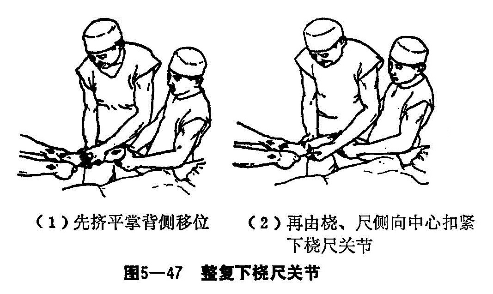
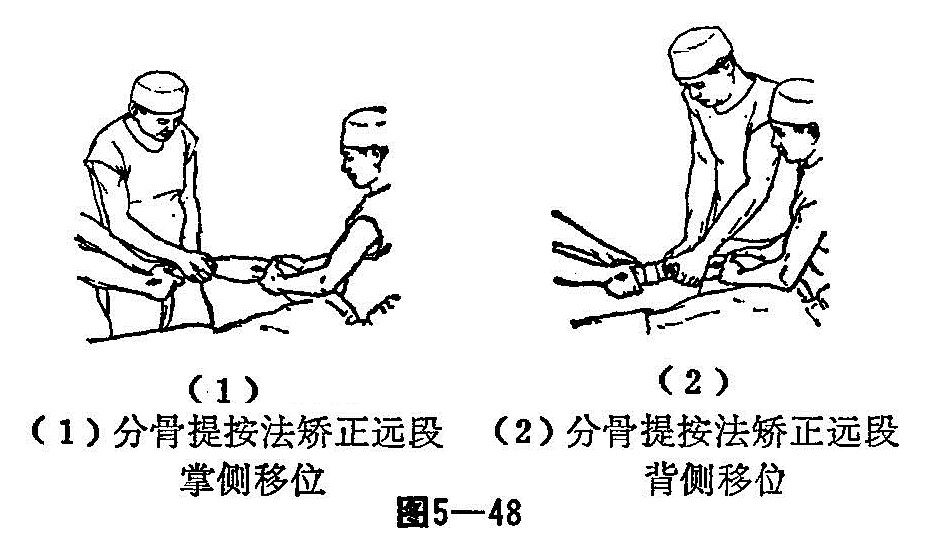

### 十三、桡骨骨折合并下桡尺关节脱位

桡骨骨折合并下桡尺关节脱位，又名辅骨。骨折兼辅臂关节脱位，亦称盖里济氏骨折。桡骨下端较大，近似方形，内侧桡骨尺切迹，与尺骨小头构成下桡尺关节。自桡骨切迹下缘和尺骨茎突之间有一三角形关节盘，名为三角软骨盘，它与下桡尺关节囊和下桡尺韧带共同维持下桡尺关节的稳定，这些组织损伤，常致下桡尺关节脱位（图5—46）。

〔病因病机〕

直接和间接暴力均可引起此类骨折。直接暴力如伤肢被重物打击前臂桡骨背侧或被卷入旋转的机器轮带中发生骨折，其残余暴力随桡骨沿下或直接压挤使三角软骨盘和下桡骨韧带损伤破裂，并发下桡尺关节脱位。儿童病例中，下桡尺关节常不发生脱位，但多合并尺骨下端骨骺分离。尺骨骨骺端仍保持其正常位置，尺骨下端骨骺随桡骨下端向背侧、近段移位。

间接暴力所造成的骨折，和桡骨下端骨折（科累斯氏骨折）相似。如患者向前跌倒，前臂在旋前、旋后位或中立位，掌心触地所产生的对抗力所致。但在发生原理上和桡骨下端骨折有所不同，跌倒时，手掌着地，前臂纵轴离开躯干中线较远，和地面所成的角度呈45°以下，因而所造成的骨折平面较高，常发生在桡骨中、下段交界处骨折。骨折一般以横断为多，螺旋或斜行型较因骨远端被外力推向上方时，三角纤维软骨及尺侧韧带损伤或尺骨茎突骨折（撕裂性）而产生下桡尺关节脱位。如跌倒时，前臂在旋前位着地，一般桡骨骨折远端向背侧移位，前臂旋后位或中立位时，则桡骨远折段向掌侧移位，临床上以后者多见。

〔诊断〕

伤肢前臂较肿、疼痛，局部触痛，桡骨中、下段骨折有向掌、背侧成角移位时，可触及到骨折端的异常活动或骨擦音，尺骨小头常向尺侧突起，腕呈桡偏状，此类骨折合并脱位的病理变化比较复杂，临床上分三型：

1.稳定型：桡骨干下1/3横断（或青枝）骨折，骨折无明显移位并尺骨下端骨骺分离，骨折稳定，常见于儿童。

2.不稳定型：桡骨下1/3骨折，骨折呈短斜面或螺旋型，偶而粉碎，骨折远端向掌、背侧移位，合并下桡尺关节脱位。

3.特殊型：桡骨干骨折，下桡尺关节脱位合并尺骨干骨折或弯曲畸形，拍摄正侧位X线片，以助明确诊断。

〔治疗〕

明确骨折类型及骨折移位情况，以便确定整复步骤。特殊型以先整复尺骨骨折的成角移位，再按本骨折复位方法整复，小夹板外固定。

1.手法整复：

（1）拔伸牵引：患者平卧位，臂丛麻醉，一助手握住患肢拇指及四指，另一助手握住上臂，肩关节外展70〜80°，肘关节屈曲90°，前臂在中立位置牵引3〜5分钟，远段助手加重拇指侧拔伸，使桡侧承受较大的牵引力，以减轻拇长展肌和拇短伸肌对远段骨折的挤压，矫正骨折重叠移位。

（2）整复下桡尺关节：在两助手牵引下，将重叠移位完全拉开后，术者先用拇指及中、食指挤平掌、背侧移位，再用两拇指由桡、尺侧向中心扣紧挤压下桡尺关节（图5—47）。关节脱位整复后，用合骨纸压垫，置于腕部背侧，由桡骨茎突掌侧1厘米处绕过背侧到尺骨茎突掌侧1厘米，作半环状包扎。用胶布固定后，由远段牵引之助手，用两手抱握腕部，并用力环抱下桡尺关节维持固定。

（3）分骨提按法，矫正掌、背移位：桡骨远段向尺、掌侧移位，术者站于患者前外侧与持腕部的助手几乎平行，一手拇指在背侧食、中、环三指作近段分骨，另一手拇指及食、中、环三指作远段分骨。然后在两手拇指的分骨下，右手掌侧三指由掌侧提托远段向背侧。同时，右手拇指由背侧挤按近段向掌，使之对位（图5—48）。

（4）分骨折顶法：应用以上提按方法未能将掌、背侧移位矫正，远段向掌侧移位者，可用两拇指抵于向背移位的骨折近段与其他四指夹挤骨间隙，在分骨情况下，先将近段按掌侧加大成角，因有尺骨未断，不能前臂双骨折一样成角太大，待感有阻力后，托于远段右手食、中、环三指，骤然提托远段向背侧反折。在反射过程中，一般掌、背侧移位均可矫正。如仍留有桡骨远段向尺侧残余移位时，术者左手拇指及食、中、环三指在分骨下固定远段，右拇指用力向中心推挤近段，使之完全对位。

（5）夹挤腕法：骨折完全复位后，应再检査下桡尺关节固定是否稳定，如固定有松脱，应再次夹挤腕部，重新固定，整复完成后，用分骨垫、小夹板临时固定，经X线复查，如有移位，须再整复。

2.固定方法：在维持牵引下和分骨下，捏住骨折部，先敷消肿驳骨膏，用绷带包绕固定，随后放置分骨垫，背侧置于桡骨缘，掌侧置于尺侧腕屈肌与掌尺肌腱之间。分骨垫在骨折线远段占2/3，骨折线以上占1/3（图5-49）。以胶布条分别固定，根据远段移位方向，再相应再加平纸垫，然后放置夹板；背侧夹板下达桡骨茎突”限制腕关节背伸只能达25°左右，上平桡骨头，掌侧板下达腕横纹，上连肘窝下2厘米，以不妨碍肘关节屈曲90°为宜，桡侧板下连掌腕关节、上平桡骨头，尺侧板上连尺骨鹰咀，下连尺骨茎突。能使腕关节尺偏30°，用四条扎带捆扎夹板。

3.术后处理和功能锻炼：术后要观察伤肢肿胀及血运情况，定时X线复查，如有移位应即时矫正，麻醉消失后，即开始作手部握拳、耸肩活动，练功步骤与前臂双骨折同，但在治疗期间，每周在维持牵引下，更换外敷中草药及敷料一次，每两周拍片一次，达到临床愈合标准，即可拆除外固定，外洗舒筋活络中草药洗剂。
