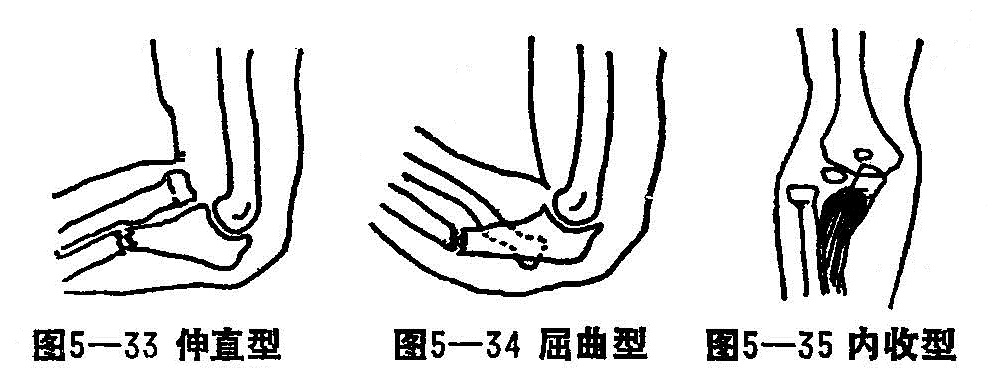
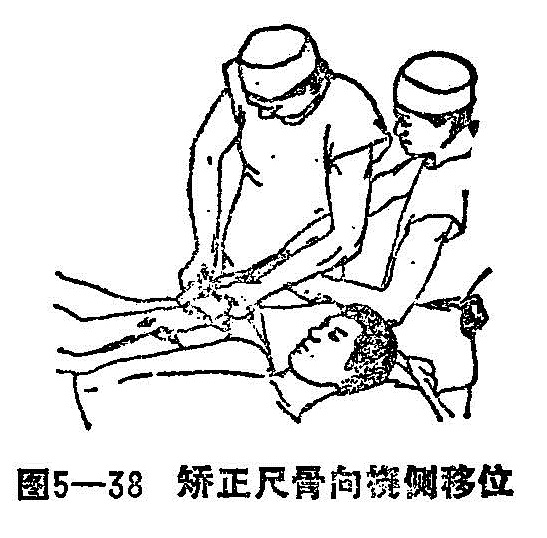

### 九、尺骨上1/3骨折合并桡骨小头脱位

尺骨上1/3骨折合并骨小头脱位，又名臂骨上段骨折及臑辅关节脱位，现代多称孟特阿氏骨折。为骨折和脱位同时发生的创伤，多见于青少年。

〔病因病机〕

常为间接暴力所引起，直接暴力多见于转动机器辗压或重物挤碰所致，但较少见。根据暴力作用方向和骨折的移位情况，临床上分为四型：

1.伸直型：多见于儿童。如肘关节伸直或过伸位跌倒，前臂旋后，掌心触地时，跌扑之力自肱骨传向下前方，地面的反作用力通过掌心传导向上前方，先造成尺骨斜行骨折，残余暴力转移于桡骨上端，迫使桡骨头冲破或滑出环状韧带，向前外方脱出，骨折断端随之向掌及桡侧成角（图5-33）。在成人病例中，外力直接打击尺骨背侧，亦可造成伸直型骨折，骨折多呈横断或粉碎型。

2.屈曲型：多见于成人。如肘关节屈曲，前臂旋前位跌倒，掌心触地时，躯干重力通过肱骨向下向后。传导暴力通掌心向上向后时，在尺骨的较高平面先发生骨折，骨折面呈横断或短斜面型。桡骨头由于肘关节屈曲及向后传达的剩余暴力，使其向后外方滑脱，骨折亦随之向背侧、桡侧成角（图5—34）。

3.内收型：多见于幼儿。肘关节伸直，前臂旋前时，肱骨亦有45°的内旋，内、外两髁处于由内后向前外的方向。上肢略处于内收位向前跌倒，暴力自肘内方推向外方，在尺骨喙实部发生横断纵裂或纵行劈裂性骨折，骨折移位较少或仅向桡侧成角。桡骨头向外侧脱位（图5—35）。

4.特殊型：多由直接暴力所致，常见于成人。如前臂受重物撞碰或挤压或受转动之机器辗压、扎伤，造成尺、桡骨折双骨折，软组织伤较严重，桡骨头向前、外侧脱位（图5-36）。

〔诊断〕

结合外伤史，肘部及前臂均有不同程度肿胀。骨折移位者，可见尺骨成角畸形，在肘前、外或肘后方可摸及脱位之桡骨头，局部触痛。前臂及肘关节功能障碍。拍摄X线片时，前臂正、侧位需包括上、下肘腕两个关节。注意肱桡关节的解剖关系：正常桡骨头与肱骨小头相对，桡骨干纵轴线向上延长，通过肱骨小头中心。因桡骨头向外脱出，部分病例挫伤桡神经，但骨折整复后，挫伤之神经一般多能恢复。因桡骨小头脱位后，有的可能自动还纳，故凡尺骨上1/3骨折，不一定显示桡骨小头脱位。

〔治疗〕

治疗前，均应结合受伤原因，明确骨折类型及移位情况，确定治疗方案。采用手法整复，小夹板外固定法，均能达到满意疗效。

1.手法整复：

（1）牵引：患者平卧位、肩外展70〜80°，成人用臂丛麻醉，幼儿用氯胺酮全身麻醉（或不麻醉），伸直型骨折肘关节90°屈曲牵引，屈曲型骨折肘关节伸直牵引。前臂中立位置，两助手对抗牵引3〜5分钟，矫正骨折重叠移位。

（2）整复桡骨头脱位：以左侧伸直型骨折为例。在助手牵引下，术者站在患肢外侧。术者右手拇指在桡骨头外侧，左手拇指置于桡骨头掌侧，用力由外由掌侧向内向背推挤（图5-37）。如为屈曲型骨折，两拇指由外侧、背侧向内、向掌推按。有时可听到或感觉到桡骨复位的滑动。复位后，咐牵引近段的助手，用拇指固定桡骨头，维持复位。

（3）矫正掌、背侧成角或移位：一般伸直型骨折断端向掌成角，近侧骨折段重叠移位于远段掌侧。在固定桡骨头及牵引下，术者面向远侧牵引助手，用一手在骨折部的掌背侧夹挤分骨；另一手的拇指按压骨折远端，食、中、环三指捏住骨折近端，向掌侧徐徐加大成角，而后反折。在反折时，该手拇指仍然向掌侧按压骨折远端，而食、中、环三指用力提拉骨折近端向背，直至向掌侧的成角移位矫正为止。

屈曲型骨折与伸直型恰好相反，骨折向背成角，近段断端向背移位，远段断端稍偏掌侧。术者面向近侧牵引助手，施行以上相反手法，矫正骨折的向背成角移位。

（4）矫正尺骨桡侧移位或成角：在维持牵引下，将肘关节屈曲90°，然后术者用手捏住骨折近段向尺侧提拉，同时咐持远段之助手用力牵引手腕向桡偏，使尺骨远段向尺侧复位，从而矫正尺骨向桡侧移位（图5-38）。内收型骨折同时由桡侧挤按桡骨头，使之还纳，尺骨向桡侧成角亦可矫正。在维持牵引下临时作纸压垫、小夹板固定。经X线检查，如位置满意，即正式固定。

对于内收型骨折只需用拇指顶压桡骨头，使之复位或用快速捶击法复位，其固定同伸直型。

快速捶击法：患儿坐位，前壁旋后位置于桌面，一助手固定上臂，术者一手控前臂，在骤然用力牵引时，另一手握拳，由肘关节桡侧轻轻拳击向脱位之桡骨头，脱位可立即复位，向桡侧成角之尺骨骨折亦随之矫正。近年来，天津医院，对本骨折治疗，以先复位桡骨头脱位，极变肘关节屈曲位固定桡骨小头的稳定，以桡骨为支撑作用，自行将尺骨骨折对位，使尺、桡骨骨折及脱位相对稳定。幼儿以“8”绷带固定肘关节、成人加用石膏托、腕颈带胸前固定3周，待骨折纤维愈合，再改用前臂双夹板肘屈曲90°固定致骨折愈合，从而简化治疗方法。

特殊型骨折，受伤暴力较大，软组织损伤严重，在治疗前，必须认真检查，有无合并神经、血管损伤。在一般情况下，以先整复桡骨小头脱位并加以固定，然后以尺、桡骨折法整复骨折，以肘关节极度屈曲法固定，均取得预期的效果。如伤肢肿胀严重、肢端发白、变凉，感觉迟钝，脉搏减弱或消失，被动手指时疼痛加剧，应考虑神经或血管损伤，治疗中要密切观察伤肢的血运及肤温情况，如无改善，要注意预防前臂筋膜综合征的发生，必要时松解外固定，短期观察治疗，仍无改善血运情况，应行前臂探査减压手术治疗。

2.固定：在维持牵引并分骨下，稳定桡骨头。敷好消肿驳骨膏，包绕绷带2〜3层。首先在骨折部的掌背侧各放分骨垫一个。分骨垫在骨折线上、下各一半。屈曲型骨折背侧的平纸垫略厚于掌侧，以防骨折部向后成角。伸直型骨折的掌侧略厚于背侧，防止向掌侧成角。而后将葫芦形纸垫放于桡骨头的前外侧（伸直型）或后外侧（屈曲型），环抱桡骨头。最后在尺骨干的侧上、下两端，各放一平纸压垫（图5—39）。用前臂双夹板，以四条扎带捆扎，肘屈90°外固定，前臂中立位托板悬挂于胸前。屈曲型骨折固定与伸直型相反。

3.功能锻炼：基本与前臂双骨折同，但为了确保桡骨头复位后稳定，肘关节在屈曲位2〜3周才开始活动伸屈锻炼。在前臂功能锻炼时，应保持中立位，严防尺骨骨折处的旋转活动。
