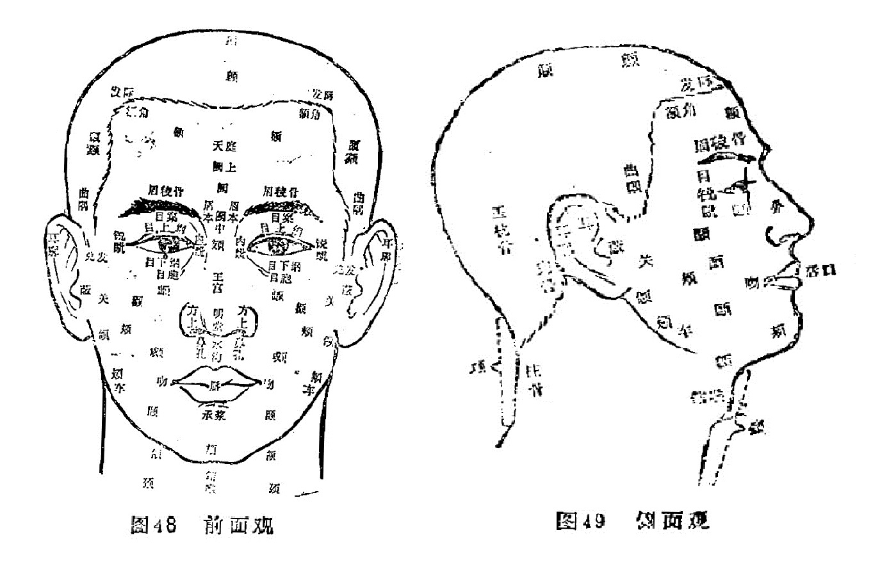

#### （一） 前、侧面观（见图48、49）
1

头：又称首，颈项以上部位均属头部。

颠：又称颠顶、头顶，为头的上部中央最高处。其内中之头骨又称颠顶骨、顶骨。

囟（xìn信）：位于顶之前，又称囟门，今称前囟。婴儿时由于额骨与顶骨未闭合而形成。正常时微陷软而跳动之处即是。

髮际：就是头髮的边缘，额上髮际称前髮际，项后髮际称后发际。

额：又称颡（sǎng嗓）、额颅。位于前发际下，两眉之上部分，额部之骨骼称额骨。

额角：额的左右两侧隆起部分，左侧为左额角，右侧为右额角。系额骨在前发际下两侧凸起所形成。额骨的前发际下，正中部分，又称凌云骨。

颜：又称庭、天庭，指额部中央部位。一说指左右眉目之间。

阙（quē 缺）：两眉之间，及其略上之额部的一部分通称阙。两眉之间称阙中，又称印堂、眉心。阙中略上部分，又称阙上。

鼻：又称明堂，两侧鼻翼称方上。

頞（è扼）：又名下极，俗称山根，即鼻根部，位于两目之间，鼻柱之上凹陷处，形如马鞍。

王宫：俗称鼻柱，位于鼻根之下，鼻尖之上。一说王宫称下极。（《灵枢·五色篇》：“王宫位于下极。”）

明堂：又称鼻隼（sǔn损）、面王，俗称鼻头。鼻也通称明堂（见前）。

水沟：即鼻下上唇正中之沟，又称人中。

吻：口之周围部分称吻，但通常以两口角部称吻。

承浆：下唇之下，颏之上中央凹陷处。

颏 （kē科）：又名地阁，俗称下巴。位于承浆之下，颊车前部分，相当今称之下颌骨体部位。

颔（hàn汉）：颏之下，结喉之上，及两侧空软处。即今称之下腭底与甲状软骨之间的部位。

颈：头与胸（胸骨体上缘）之间。

结喉：即今甲状软骨前上方之隆起处。

睛明骨：眼窝周围的骨骼称睛明骨，由额骨和䪼骨构成。

眉棱骨：今称眉弓，系睛明骨的目上部分，即额骨之眶上缘弓形凸起部分。

眉本：俗称眉头，即眉毛内侧端部位。

眼睑：又名目胞，目窠、目裹、目睑，俗称眼胞、眼皮，分为上下脸。

目上纲、目下纲：又称上弦、下弦。今称睑缘。

目睛（眼球）各部名称：瞳神，今称瞳孔，瞳神外之棕黑色部分称黑睛；黑晴外围之白色部分称白睛。

目系：又名目本，是目睛与脑相连系的脉络组织。

目内眥（zì自）：又名大眥，即内眼角。

目外眥：又名小眥、目锐眥，即外眼角。

䪼（zhuō拙）：目之下，颧之上，即相当于今称之上颌骨和额骨构成眼眶的部位，构成眶部之骨，称䪼骨，也是睛明骨之一部（目下部分）。

颧：又称頄（qiú求），眼眶下外侧之高骨部位，内为颧骨所在。

关：耳前凸起部位，即今之颧弓部位。

颊：耳前、颧下部位。

顑：（kǎn砍）：俗名腮，系口旁、颊前肉之空软处。

颐：（yí宜）：口角后、腮下部位。

颞颥（niè rú聂如）：俗名太阳，位于眉棱骨外侧、颧弓上方。

曲隅：又名曲角、曲周，俗名鬓角，为额角外下方、耳前发际弯曲下垂部位。

蔽：俗名耳门，今称耳屏。

颌：又名辅车，即下颌骨支，为下颌骨耳下部位。

曲颊：即下颌角部，又名颊车。

牙床：即牙车，因其屈曲向前，故名。俗称下巴骨。

舌本：即舌根。

上腭：口内，与上牙床相连之上部，与今称之上腭，名位均同。

会厌：即今会厌软骨。

嗌：指咽，一指喉。

咽：食管上口。

喉：又名肺系，即喉咙，颈部气管的通称。

颃颡（háng sǎng杭嗓）：咽喉上端，相当于鼻咽部。

耳廓：为外耳道以外的全部耳壳的统称。

兑（锐）髮：指耳前方之髮角。
