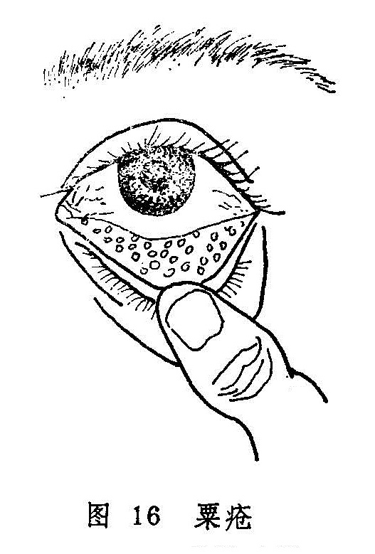

## 粟疮 

本病为睑内生颗粒累累，色黄而软，状似粟粒，故名粟疮。本病名见于《证治准绳》，然《秘传眼科龙木论》和《银海精微》皆将本病总括于“睑生风粟”中，《医宗金鉴•眼科心法要诀》则迳称粟疮为“睑生风粟”。《审视瑶函》明确指出：“此症生于两睥之内，细颗黄而软者是。今人皆称椒疮为粟疮者，误矣。”本病可与椒疮相混而生，也可单独发病。本节主要讨论单独发病时的证候及其治疗。

本病与椒疮均为胞睑内面发生颗粒的病变，应注意鉴别（表3）。

表3 椒疮粟疮的鉴别

|            | 椒疮                                                         | 粟疮                                                         |
| ---------- | ------------------------------------------------------------ | ------------------------------------------------------------ |
| 颜色       | 鲜红或暗红                                                   | 黄或黄白                                                     |
| 形态       | 较大、不透明                                                 | 较小、半透明                                                 |
| 质地       | 较坚硬                                                       | 较软                                                         |
| 自觉症状   | 沙涩羞明微痒，严重时多泪微痛                                 | 可无明显感觉，若受邪可突发目赤或目痛。                       |
| 检查       | 多发生于上睑内面，血络红赤，模糊不清，初期颗粒极小，后则椒粒样小泡参布其间，内容物混浊，大小不等，形状不一，排列不整，压之易破，排出胶样物质 | 多发于下睑内面，血络正常，红赤不显，颗粒较小，透明大小均匀，排列整齐；界限分明，压之不硬。 |
| 黑睛  病变 | 或有赤膜下垂，倒睫拳毛，或生星翳。                           | 无                                                           |
| 预后       | 不易消散。病变愈后留有疤痕，易生并发症和后遗症               | 易消散，愈后不留疤痕，无并发症及后遗症                       |

〔病因病机〕

多由脾胃湿热，风热之邪外乘，或因脾胃虚弱，水湿运化不畅，湿邪阻遏胞睑脉络。壅积胞睑而成。多见于儿童及青少年。

〔辨证论治〕

（一）辨证要领

本病有慢性与急性发作两种类型。其为慢性者，起初常无明显自觉症状，或仅感微痒不适。检视胞睑内面（主要见于下睑内面），可见有粟粒样小泡簇生，形圆，色黄或黄白，半透明，质地较软，排列密集，境界较分明，尤其是在睑内与白睛交接处最多（图16）此为脾虚湿阻所致；若见睑内红赤，自觉沙涩不适，羞明流泪，则系湿热壅阻而成；若属急性发作，兼见胞睑肿胀，目痛痒难睁，白睛赤丝纵横，又为湿热兼受风邪所致。

（二）论治要点

本病一般系风、湿、热邪为患，故内治多用祛风、除湿、清热等法。其中症状轻微，且无明显痛苦者，可以外点药治之，点而不消者，再配以内服药治疗。内服药当分清风、湿、热之孰重孰轻，而用五皮散治疗湿邪偏盛者，甘露消毒丹治疗湿而兼热者，除风清脾饮用于风热偏甚者。若小泡日久不消，亦可参照椒疮，施以海螵蛸棒摩擦术，以加速消散。

（三）常见证治

1.内治：

（1）脾虚湿阻：

证候：自觉症状不显，或仅有轻微的痒涩感。翻转胞睑，可见下睑内生有大小均匀，数量不一的淡黄色颗粒，质地较软，经年累月而不消。

治法：健脾除湿。

方例：五皮散〔28〕。

（2）湿热壅阻：

证候：自觉沙涩不适，微感羞明流泪，可见睑内红赤，颗粒累积，形如粟米，色黄而软。

治法：清热利湿。

方例：甘露消毒丹〔48〕。

（3）湿热兼风：

证候：白睛及睑内突发红赤，黄白色颗粒累累，或见胞肿，或目痛痒难睁。

治法：散风清热除湿。

方例：除风清脾饮〔171〕。

2.外治：点黄连西瓜霜眼药水〔211〕或犀黄散〔241〕。

（四）临证权变

上述三型为临证之大纲。但应注意，睑内生粟疮而无明显自觉症状，且经久不消者，亦常见于体质虚弱的小儿，脾虚湿阻型患者可表现面色少华，纳差乏力，舌淡苔薄白，脉沉细或弱，治疗可改用六君子汤〔32〕加苡仁，地肤子、车前子，泽泻以加强健脾利湿之力。发病急暴者、常属湿热兼受风邪，若未伤阴，宜将除风清脾饮中的生地、元参去掉，体质较弱或大便不干者，又宜去大黄、玄明粉，选加苦参、车前子、木通、赤芍等清热除湿通络。

〔调护〕

饮食有节，食宜清淡，忌食辛辣鱼腥。

〔文献摘录〕

《审视瑶函》：“脾经多湿热，气滞血行迟，粟疮胞内起，粒粒似金珠，似脓脓不出，沙擦痛无时，睥急开张涩，须防病变之。”

《医宗金鉴•眼科心法要诀》：“粟疮如粟，其形黄软，属脾经风热而成。”又指岀：“宜劆洗出血，服除风清脾饮，……倍荆芥防风。”
