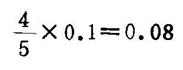

### 二、视力检查法

严格地讲，视力可分中心视力与周边视力。本节所谓视力，乃指中心视力；周边视力又称视野，检查方法将在下节介绍。

1.中心视力检查法中心视力通常简称视力。有远视力与近视力两种。注视5米或5米以外目标的视力曰远视力，阅读（距30厘米）时的视力曰近视力。中心视力检查是测定黄斑中心窝视功能的主要方法，是眼科常规检查的重要项目之一。在问诊结束后即可进行。对患者事先要说明此项检查的重要意义，使其能够充分合作。

（1）远视力检查：将国际标准视力表挂在自然光线充足或有日光灯照明的墙壁上。视力表与被检者相距5米，表上第10行视标的高度与被检眼应在同一水平。检查时应遮盖一眼。一般先查右眼后左眼，自最大视标0.1顺序而下进行，直至被检眼能最后明确地指出字向的视标，即为该眼的视力。如该眼只能准确地看清1.0视标各个字向，其视力即记为1.0，另一眼只能看清0.5视标字向时，则另一眼的视力为0.5，其余类推。正常视力为1.0以上。

若被检者在5米处不能辨别最大视标字向，需嘱其逐渐向前行进，至辨清最大视标为止，测量其与视力表的距离，然后按下列公式计算。

如被检者在4米处才能辨别0.1视标，则该眼视力为、3米为0.06、2米为0.04、1米为0.02。

如被检者已前进至距视力表1米，仍未能辨别视标时，则瞩其辨别距离眼前若干厘米的指数或手动，并加以记录。例如右眼视力：指数或手动/30厘米。若被检者连手动都不能辨别，则应进入暗室，测其光感。检查时应严密遮盖另眼，使不透光。患眼如能辨别灯光（如电筒光）明灭，亦应记录距离，写为几米光感或眼前光感。如在暗室内完全不能辨认灯光，则该眼视力为无光感。

（2）近视力检查：检查须在充足自然光线或灯光下进行。近视力表置于眼前30厘米处，两眼分别进行，由最大视标0.1开始，顺序向下。凡能辨明1.0以上视标字向者，该眼近视力正常，如不能在30厘米辨明1.0，则将视力表向眼前或后移动，至能辨明最小视标字向的距离为止，然后分别记录。如1.0/20厘米，或0.5/30厘米等。正常为1.0/30厘米。
