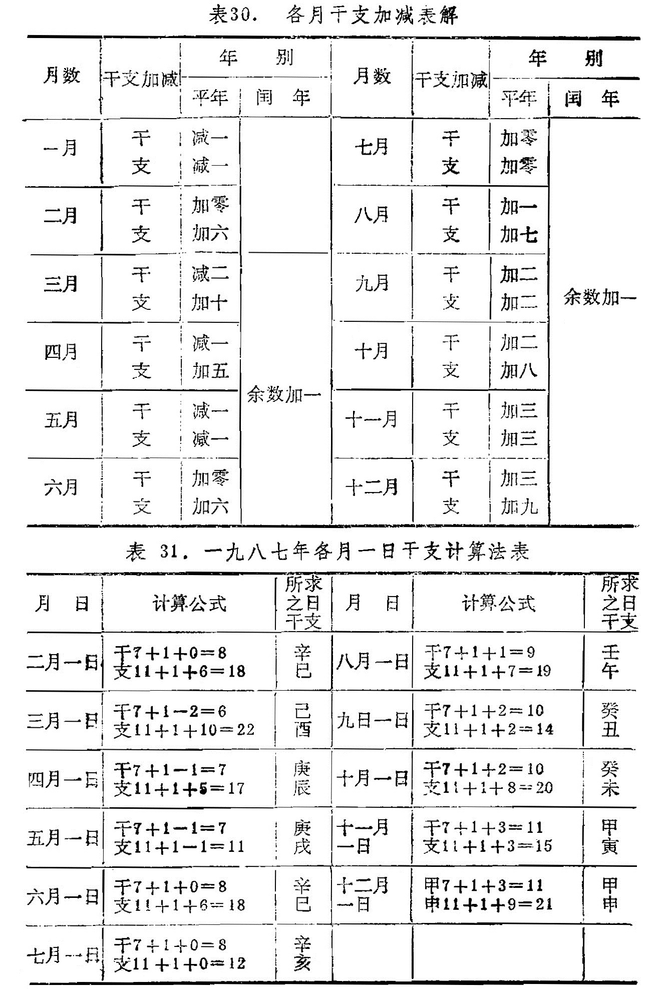

## 子午流注开穴针法 

它是以十二经脉肘膝以下的六十六个经穴为基础，根据出井、溜荥、注输、行经、人合的气血流注、盛衰开阖的道理，配合阴阳、五行、天干、地支等逐日按时开穴的一种针刺取穴配方法。

子午流注选穴配方针法作为“因时制宜”的法则，注重和强调择时与选穴两个方面。人在自然环境中，外界的温热寒凉与朝夕光热的强弱对人体的气血流注有着不同的影响，而人体对其影响则相应地产生了“节奏反应”的生理现象，择时就是依据气血流注的盛衰时间为主体，选穴则优选十二经疗效最佳的五输穴，二者结合，就是子午流注选穴配方针法的中心内容。

### 子午流注的意义  

子午是指时间而言，它是地支中的第一和第七数。子为夜半，午为日中，是阴阳对立的两个名词，是古代人们用来记述年、月、日、时的符号。子为阳之始，午为阴之始。如以一年为例，子是十一月，午为五月，冬至在十一月，夏至在五月（农历）；以气候言之，子时寒，午时热，再以一天言之。子为夜半的23～1点，午为日中的11～13点，可见子午含有阳极生阴，阴极生阳的意义，说明了子午是阴阳转化的起点与界线。

流注二字，流指水流，注指注输，在这里是将人体的气血循环比做水流，以井，荥、输（原）、经、合来作比喻，指出水之发出为井，渐成细流为荥，所注为输，所行为经，然后汇合入于泽海，用来表示脉气的流注过程。

子午流注是将机体的气血循行，周流出入，比拟水流，或从子到午，或从午到子，随着时间先后的不同，阴阳各经气血的盛衰，也有固定的时间，气血迎时而至为盛，气血过时而去为衰，泻则乘其盛，补则随其去，逢时为开，过时为阖，定时开穴，以调和阴阳，纠正机体的偏盛偏衰来治疗疾病。可见子午流注是在人与自然的理论指导下，逐渐演变所创立起来的具有独特意义的一种针刺取穴法。

### 子午流注的起源与发展

子午流注，历史悠久，源远流长，其理论体系溯源于《内经》。如《素问·六微旨大论》说：“ **天气始于甲，地气始于子，子甲相合，命曰岁立，谨候其时，气可与期** ”。《素问·六节脏象论》说“ **天以六六为节，地以九九制会，天有十日，日六竟而周甲，甲六复而终岁，三百六十五日法也** ”。《灵枢·卫气行》说:“ **岁有十二月，日有十二辰，子午为经，卯酉为纬** ”。《灵枢·经别》说“ **人之合于天道也，内有五脏，以应……五时……。** ”《素问·宝命全形论》也说：“ **人以天地之气生，四时之法成。** ”这是古代人们仰观天象，俯窥地理所体认出来的。用子午十二地支来代表，划分一年四季寒暑和一天昼夜的不同，从而认识到人体五脏与自然相适应，这就为子午流注按时分配脏腑的规律提供了条件。由于宇宙、环境有规律的变化，而人体气血流注也有一定的规律性，所谓“各有其时，更始更终，无有休止”，因而《素问·八正神明论》指出“ **凡刺之法，必候日月星辰，四时八正之气，气定乃刺之** ”，“ **先知日之寒温，月之虚盛，以候气之浮沉而调之于身** ”。说明按时针灸是从日、月运行节律与人体气血运行盛衰来立说的。由此可见古时在治疗时，重视日时寒暖和脉气盛衰，这就为子午流注针法提供了理论基础。

继《内经》之后，又有《难经》、《针灸甲乙经》、《子午流注针经》诸书，均对井、荥、输（原）经、合流注有所论述。特别是《难经》六十四、六十五难明确指出五输分属五行，对其意义等都作了分析说明，并对十天干的运用作了概括性的阐述。晋·皇甫士安在他撰著的《针灸甲乙经》中又将心经五俞穴补上，始成66个五俞穴，这为子午流注针法的临床应用，提供了依据。

宋金时代，由于干支学说盛行，对医学有着一定的影响，因而研究子午流注的医家，更是盛极一时，著述颇多。如南唐·何若愚运用子午流注针法，按时开穴，以补生数写成数的河图、生成数，以及“五门十变”之说为基石，撰写了《子午流注针经》三卷；窦汉卿提倡八法流注，按时治疗，著有《标幽赋》、《通玄指要赋》，对气血流注，时穴开阖的重要性也都作了扼要的叙述。如他指出“ **一日取六十六穴之法，方见幽微；一时取一十二经之原，始知要妙。……推于十干十变，知孔穴之开阖；论其五行五脏，察日时之旺衰。** ”这些都为子午流注纳干法开穴奠定了基础。

明代针灸著述更多，诸家对流注针法的研究也很重视。其中李梴、徐凤、杨继洲、高武等人，都对子午流注针法的运用和机理作了发挥性的闸述。如高武所论“ **十二经病井荥输经合补虚泻实** ”法，又为子午流注纳支法的取穴开创先例。特别是徐凤著《针灸大全》记载了子午流注逐日按时定穴歌十首，这给运用子午流注针法的开穴提供了一个简明的方法，后世应用流注针法，均以此为依据。

由于子午流注针法的取穴，较难于一般取穴法，加之后人缺乏研究，更因清代轻视针灸，认为“针刺，艾条究非奉君之所宜”，针灸学术每况日下，流注针法无人应用，致使这一古法频于失传。

解放后，在中医政策感召下，老一辈中医发奋图强，曾有四川吴棹仙、江苏承淡安等先后发表有关著述，从而使流注针法得以继承下来。

### 子午流注针法的组成  

子午流注针法，是由天干、地支，阴阳、五行、脏腑、经络以及肘膝以下的五输穴联合组成的一种逐日按时开穴针法。所以要运用它，心须掌握这些内容，这是推算本法的必要条件。现分述如下：

#### 1.干支配合六十环周的计算法：

干指天干，支指地支，它是古代用来记述年、月、日、时的符号，所以它等于1、2、3、4、5、6、7、8、9、10个数。如《素问·六微旨大论》指出：“ **天气始于甲，地气始于子，子甲相合，命曰岁立，谨候其时，气可与期** ”。这是运用干支来计算年、月、日、时以便了解六气的变化。

天干是甲、乙、丙、丁、戊、己、庚、辛、壬、癸；地支是子、丑、寅、卯、辰、巳、午、未、申、酉、戌、亥。天干起于甲，地支起于子，二者配合起来就成了甲子、乙丑、丙寅、丁卯……。如表25。

表25．干支配合六十环周表

| 1.甲子  | 2.乙丑  | 3.丙寅  | 4.丁卯  | 5.戊辰  | 6.己巳  | 7.庚午  | 8.辛未  |
| ------- | ------- | ------- | ------- | ------- | ------- | ------- | ------- |
| 9.壬申  | 10.癸酉 | 11.甲戌 | 12.乙亥 | 13.丙子 | 14.丁丑 | 15.戊寅 | 16.己卯 |
| 17.庚辰 | 18.辛己 | 19.壬午 | 20.癸未 | 21.甲申 | 22.乙酉 | 23.丙戌 | 24.丁亥 |
| 25.戊子 | 26.己丑 | 27.庚寅 | 28.辛卯 | 29.壬辰 | 30.癸巳 | 31.甲午 | 32.乙未 |
| 33.丙申 | 34.丁酉 | 35.戊戌 | 36.己亥 | 37.庚子 | 38.辛丑 | 39.壬寅 | 40.癸卯 |
| 41.甲辰 | 42.乙巳 | 43.丙午 | 44.丁未 | 45.戊申 | 46.己酉 | 47.庚戌 | 48.辛亥 |
| 49.壬子 | 50.癸丑 | 51.甲寅 | 52.乙卯 | 53.丙辰 | 54.丁巳 | 55.戊午 | 56.己未 |
| 57.庚申 | 58.辛酉 | 69.壬戌 | 60.癸亥 |         |         |         |         |

由于天干起于甲而终于癸，计有十数；地支起于子而终于亥，计有十二数，到轮回第一个干支——甲子，需要天干轮六次，地支轮五次，即天干10×6=60，地支12×5=60，这就是六十环周法。它是计算年、月、时干支的基础。

#### 2.干支分配阴阳法：

天干、地支原系代表年、月、日、时的符号，日时有单双，干支亦分阴阳；它的分法是根据自然次序之数来决定的，也就是数的1、3、5、7、9、11奇数为阳，2、4、6、8、10、12偶数为阴，同时在配合上又是阴与阳相配，阳与阳和相合。如表26。

从上表可以看出，干、支的1、3、5、7、9、11奇数。代表着甲、丙、戊、庚、壬五阳干，子、寅、辰、午、申、戌六阳支；2、4、6、8、10、12偶数，代表着乙、丁、己、辛、癸五阴干、丑、卯、巳、未、酉、亥六阴支。运用子午流注针法，就是在阳日阳时开阳经之穴，阴日阴时开阴经之穴，所以要牢记天干、地支的阴阳干支，以利推算。

#### 3.干支分配五行法；

了解干支分配阴阳之后，又应了解干支配属五行、四季。五行是指金、木、水、火、土，四季是指春、夏（长夏）、秋、冬。它们的分配是：甲、乙、寅、卯属木为春；丙，丁、巳、午属火为夏；戊、己、辰、戌、丑、未属土为长夏；庚、辛、申、酉属金为秋；壬、癸、子、亥属水为冬。一般宜牢记“东方甲乙寅卯木，南方丙丁巳午火，西方庚辛申酉金，北方壬癸亥子水，辰戌丑未旺四季，戊己中央皆属土”。为便于参考。列表27：

#### 4.时间与时辰的分配：

一天有二十四小时，古人用十二个地支时辰来代表。24：12，得出一个地支时辰代表两个小时，它的分配是：夜间占四个时辰计八小时，黎明占两个时辰计四小时，白昼占五个时辰计十小时，黄昏占一个时辰计二小时，一般宜牢记子为夜半的23～1点，午为日中的11～13点，日出卯时为5～7点，日落酉时为17～19点，即可迅速推出。现附表28。

上述时间，是以当地时间为准，因为各个地区相距有差异。1884年国际会议划分时区的办法，规定每隔经度15°算一个时区。全球分24个时区，把通过英国伦敦格林威治天文台原址那条经线定为0度经线，作为0度中央经线，从西经7.5度至东经5.7度为中时区，向东划分十二个时区，向西划分十二时区。

地理经度和时间关系，因地球每24小时自转一周（360度）则每小时自转360÷24=15度，每经度一度时刻差为60÷15=4分钟。作为地区时差计算基础。

我国北京时间是全国统一的标准时，使全国人民能正常地进行生产、工作、学习和生活，是非常必要的。但作为时空影响人体的自然变化，又应当以北京时间为基础，按照时区加以运算。例如：北京约位于东经116度，哈尔滨是东经126度，则两地时差为（126一116）×4=40分钟。成都位于东经104度，（116一104）×4=48分钟。

#### 5.年月日时干支的计算法：

子午流注针法的开穴，在于择时，因此首先要将患者来诊的年、月、日、时的干支找出，然后再逐日按时开穴，这就需要掌握年干支、月干支、日干支、时干支。特别是日、时干支更为重要。

##### （1）年干支的计算法：

推算年干支，只要掌握六十环周法，按其次序顺推即得。如1983年为癸亥年，癸亥下一个干支是甲子，则知1984年为甲子年，余皆类推。

如果不知道当年的年干支，也不知道过去任何一年的干支，可采用：

当年年数减三，再从余数中除去干支60周转数，就是所求的年干支的代数。

如求1984（年）-3=1981，以1981÷60（干支周转数）=33，余1，按六十环周顺推，一就是甲子，可见1984年为甲子年，这个计算法适用于公元4年以后的任何一年。

##### （2）月干支的计算法：

推算一年中的每月月干支，以农历计算，每年的十一月都是“子月”，五月都是“午月”，而一月都是“寅月”，这是永远不变的，至于把天干加上，使它成为干支，则应从寅月开始，一般宜牢记下歌，即可迅速的推出，歌诀是：甲己之年丙作首，乙庚之岁戊为头，丙辛之岁庚寅上，丁壬壬寅顺行流，若言戊癸何方起，甲寅之上去寻求。按：歌诀的第一句是说，逢甲年、己年，它的一月月干支都起于丙寅，丁卯即为二月的月干支，余皆类推。附表29如下。

##### （3）日干支的计算法：

推算出年、月干支之后，就要推算出日干支，推算日干支是比较繁琐的。因农历的大小月和闰月不固定，所以，在月上起日就不容易了。而阳历则不同。它除了每四年有一次闰二月外，每年的大小月都是固定不变的，所以利用阳历计算农历日干支，就方便得多。

此法是利用元旦干支的代数，用它作为基础，加上所求的日数，然后再按各月或加或减，再除去干支的周转数，所余之数即为所求之日干支代数，这是平年日干支的计算法。

逢闰年，因二月多一天，所以在用上法计算时，从三月份起，应在所求出的代数上再加一，即为闰年所求日干支的代数，至于各月或加或减，宜牢记下面一首歌，并附表，见表30。

一五双减一，二六加零六，

三减二加十，四减一加五，

七零九加二，八加一七走，

十上加二八，冬三腊三九，

闰从三月起，余数均加一。

例如，1987年元旦是庚戌，庚的代数为7，戌的代数为11，欲求1987年各月一日的日干支，即可按上述方法计算，所得之结果如表31。

按：表中第一格之月日，乃指所求之月日，计算公式中的第一数为该年元旦干支的代数，第二数为所求之日数，第三数为逐月加减数。第四数为所求之日干支的代数。

这是平年日干支的计算法，不论求哪月哪日，只要按上法计算，都可以迅速求出所需的日干支。

至于闰年的计算法，因二月为二十九天，故从三月份起，在应用上法时，在所求出的干支代数上再加一，即为所求日干支的代数。如《1988年为闰年》它的元旦干支为“乙卯”日，乙的代数为2，卯的代数为4，欲求该年各月一日的干支，按上法计算，所得之结果，如表32。

表32.一九八八年各月一日干支计算表

| 月日     | 计算公式                            | 所求之日干支 | 月日       | 计算公式                           | 所求之日干支 |
| -------- | ----------------------------------- | ------------ | ---------- | ---------------------------------- | ------------ |
| 二月一日 | 干2+1+0=3 支4+1+6=11           | 丙戌         | 八月一日   | 干2+1+1=4+1=5 支4+1+7=12+1=13 | 戊子         |
| 三月一日 | 干2+1-2=1+1=2 支4+1+10=15+1=16 | 乙卯         | 九月一日   | 干2+1+2=5+1=6 支4+1+2=7+1=8   | 己未         |
| 四月一日 | 干2+1-1=2+1=3 支4+1+5=10+1=11  | 丙戌         | 十月一日   | 干2+1+2=5+1=6 支4+1+8=13+1=14 | 己丑         |
| 五月一日 | 干2+1-1=2+1=3 支4+1-1=4+1=5    | 丙辰         | 十一月一日 | 干2+1+3=6+1=7 支4+1+3=8+1=9   | 庚申         |
| 六月一日 | 干2+1+0=3+1=4 支4+1+6=11+1=12  | 丁亥         | 十二月一日 | 干2+1+3=6+1=7 支4+1+9=14+1=15 | 庚寅         |
| 七月一日 | 干2+1+0=3+1=4 支4+1+0=5+1=6    | 丁巳         |            |                                    |              |

按：表中第一格中的日月，乃指所求之日月，计算公式中的第一数为该年元旦干支的代数，第二数为所求之日数，第三数为逐月加减数，从三月份起第五数为闰年加一数，第六数为所求日干支代数。

上述计算日干支法，只要掌握该年的基数（即元旦干支的代数），和逐月干支加减的口诀，就可以求出所需的日干支，这就需要首先掌握元旦干支，欲求以后各年的元旦干支，只要握平年元旦到下一年的元旦，干支数只差五天。而闰年则差六天，就是从上年元旦下一个干支数五个干支，即为平年下年元旦的干支，顺数六个干支，即为闰年下年元旦的干支。

例如，1987年元旦干支是庚戌，因系平年，应加五个干支，即为乙卯，则知1988年元旦干支“乙卯”日，又如1988年元旦干支是“乙卯“，因系闰年，应加六个干支，即为辛酉，则知1989年元旦干支为“辛酉”日，余皆类推。

这是因为阳历是以地球绕太阳运动为根据的历法。地球绕太阳公转一周，需时三百六十五天五小时四十八分四十六秒，所以每年元旦到次年元旦，相差仅有五天，余下五小时四十分四十六秒，积四年成一天，所以闰年二月份多一天，故闰年元旦到次年元旦，干支相差六天，这就是平年差5天，闰年差6天的缘故。

至于求何年为闰年，最简单的方法，是用四去除公元数，凡除尽者为闰年，除不尽者为平年，即可掌握何年为闰年。但需注意，每百年停闰，每四百年又不停闰。如公元2100、2200、2300等年度停闰，计算时应注意，以免错误。一般宜牢记：

四除年数尽为闰，除不尽者不闰年，

百年整数停一闰，四百除尽仍为闰，

若逢年支申子辰，便是闰年二（月）多一。

为便于参考，现将今后六十年的元旦干支。列表33如下。

##### （4）时干支的计算法：

计算出什么年、月、日干支之后，就要计算出什么时干支，才能完全掌年、月、日、时的干支，同时子午流注、灵龟八法都从日干支、时干支上开穴，因此这些计算法，必须熟记，才能运用自如。

至于日上起时，因一天起于夜半的子时，故计算时，亦从子时起，然后顺排下去即知一天的时辰干支。它的计算，首先要牢记下面一首歌：

甲己还生甲，乙庚丙作初，

丙辛生戊子，丁壬庚子头，

戊癸起壬子，周而复始求。

所谓“甲己还生甲”，是指甲、己二日，一天夜半的子时都起于“甲子”，以下就是乙丑、丙寅、丁卯……。因为由甲到戊是五天整六十个时辰，恰为一周，戊的下边就己，也就是再周的开始，

所以仍是“甲子”，余皆类推。附表34如下：

#### 6.天干与经络脏腑的配合：

子午流注针法，在逐日按时，循经取穴的应用方面，主要以干支来作为经穴和日时的代名词、所以要掌握天干与脏腑、经络的配合，这就是昔称的“十二经纳天干法，至于它们的配属，可牢记下面一首歌，为便于参考，并附表35如下。

甲胆乙肝丙小肠，丁心戊胃己脾乡，

庚属大肠辛属肺，壬属膀胱癸肾脏，

三焦阳腑须归丙，包络从阴丁火旁，

阳干宜纳阳之俯，脏配阴干理自当。

表35.十二经纳天干表

| 十干   | 甲   | 乙   | 丙             | 丁           | 戊   | 己   | 庚   | 辛   | 壬   | 癸   |
| ------ | ---- | ---- | -------------- | ------------ | ---- | ---- | ---- | ---- | ---- | ---- |
| 十二经 | 胆   | 肝   | 小肠 三焦 | 心 心包 | 胃   | 脾   | 大肠 | 肺   | 膀胱 | 肾   |

#### 7.地支与脏腑经络的配合：

子午流注针法的开穴，分有纳干法、纳支法两种。纳支法又称为广义的流注法，它专以一天中的十二地支时辰为主，不问哪天何干，亦不问哪一个时辰是属于何干，而以十二时辰配十二经来取穴，所以《针灸大成·手足阴阳流注论》中引歧伯曰：“ **经脉者，行血气，通阴阳，以荣于身者也。其始从中焦，注手太阴、阳明……，其气常以平旦为纪** ”。这说明十二经的气血，从中焦开始，上注于肺经，经过大肠，……终于肝经，再返回肺经，周而复始地自然通行着。这个流行顺序以一天来说，是从寅时起，经过卯、辰、巳、午……止于丑时，再周而复始。

气血按十二经的循行是永远不变的，而一天干地支的循行也是固定的。由于肺朝百脉，为十二经通行的起点，地支的寅也是一天的开始，因此《针灸大成》载有下记一首歌；为使于参考，并附表36如下：

表36·十二经分配地支表

| 十二支 | 子   | 丑   | 寅   | 卯   | 辰   | 巳   | 午   | 未   | 申   | 酉   | 戌   | 亥   |
| ------ | ---- | ---- | ---- | ---- | ---- | ---- | ---- | ---- | ---- | ---- | ---- | ---- |
| 十二经 | 胆   | 肝   | 肺   | 大肠 | 胃   | 脾   | 心   | 小肠 | 膀胱 | 肾   | 心包 | 三焦 |

肺寅大卯胃辰宫，脾巳心午小未中。

申膀酉肾心包戌，亥焦子胆丑肝通。

#### 8.子午流注针法所用之经穴_五输穴：

五输穴，是指十二经分布在肘膝以下的井、荥、输（原）、经、合穴而言，这些腧穴，出自《灵枢》九针十二原、本输、根结各篇。这些腧穴不但是经气出入、气血周流、阴阳交会之处，也是治疗内外各种疾病的有效针灸部位。子午流注针法开穴，就是运用五输穴，配合天干、地支，根据气血流注的盛衰来按时开穴治疗。现将十二经的五输穴与五行关系等列表37如下以供参考。

### 子午流注针法的临床运用：

“子午流注选穴配方针法”的运用，可分为三种：一为按天干开穴，次为按地支开穴，再次为养子开穴。前者称为纳干法，次者称为纳支法，再次为养子时刻经穴法。

#### 1.纳支开穴法的运用：

纳支法是一种广义的取穴法，它比纳干法推算简易。此法是以一天的十二时辰为主，不论每一个时辰配合什么天干，也不论时辰所属的阴阳，而仅按着一天中的时辰顺序，去配合十二经的气血流注，用井荥输经合的五行关系，通过补母泻子的方法达到治疗的目的，它的具体运用，可分如下两种：

#####  （1）补母泻子取穴：

它是根据脏腑配合时辰，结合各经症状的虚实，通过十二经的井荥输经合的五行关系，按着“虚则补其母，实则泻其子”的原则，来取穴治疗的。

如以肺经为例，肺实，症见咳嗽、胸痛、肺胀喘满、脉来洪大者，即可在寅时取肺经合穴尺泽泻之，这是因为气血寅时注入肺经，此时肺气方盛，肺属金，金能生水，本经合穴尺泽属水，为本经子穴，所以当肺实在寅时泻其合水尺泽，此属迎而夺之，实则泻其子的法则，其它各经实证，皆依此类推。

若属肺虚之疾，症见咳嗽气喘、惧寒怕冷、面色苍白、气弱脉微者，按补母泻子法治疗，即可在卯时，开取肺经的输土穴太渊补之。因气血卯时始流过肺经，此时肺气方衰，肺属金，土能生金，本经输穴太渊属土，为本经的母穴，所以当肺虚在卯时补其输土穴太渊，此属随而济之，虚补其母的法则。其它各经虚证，皆依此类推。

若遇补泻时间已过，或不虚不实的症状，亦可取与本经同一性质的经穴——本穴、原穴。如肺经疾患，可取经渠；大肠经疾患，可取合谷；胃经疾患，可取足三里等等，为便于参考，附表38。如下：

##### （2）按时循经取穴：

它是以一天分为十二时辰，一个时辰分配一经，即寅属肺，卯属大肠，辰属胃，巳属脾，午属心……。当某经发生疾患，即于某时采取某经的经穴治疗。如肺经有病则在寅时取肺经的经穴治疗，胃经有病则在辰时取胃经的经穴治疗，余皆类推。

#### 2.纳干开穴法的运用：

此法为临床常用的一种子午流注开穴法，运用此法，首先要将患者来诊的年、月、日、时干支推算出来（可按上述方法推算之），然后结合人体十二经脉的流行和井荥输（原）经合的五行相生规律而顺次开穴，也就是说，此法是按时开穴，时上有穴，穴上有时，所以《医学入门》指出：“ **按日起时，循经寻穴，时上有穴，穴上有时。** ”至于该法的具体运用，必须掌握以下几点规律：

##### （1）按时开穴：

按时开穴，主要是根据年、月、日、时的干支顺次取穴，它的规律是阳日阳时开阳经之穴，阴日阴时开阴经之血，是本着阳进阴退①的规律，不断地推演循环的，这是开取井穴的方法，如表39：

①“阳进阴退”：是指天干为阳主进，地支为阴主退而言，它是推算次日的干支开取井穴时辰的方法。如甲日甲戌时开取胆井穴窍阴，要推算乙日开井穴的时间，根据阳进阴退原则，则天干从甲进一数为乙，地支从戌退一数为酉，则知次日（乙日）开井穴大敦应在“乙酉”时，余皆类推。

从上表可看出，按时推算“阳进阴退”的原则。

日天干属阳主进，故由甲进乙，由乙进丙，由丙进丁……此为阳进；时支属阴主退，故由戌退酉，由酉退申，由申退未……此为阴退。由此可见，按时开穴皆本“阳进阴退”的规律，此为推算十二井穴按时开穴的方法，临床必须掌握。

至于癸日肾经井穴涌泉，则不按“阴退”的原则，在癸丑时开穴，而应在癸亥时开井穴涌泉，这是因流注从甲日起开穴，前后经过九天，而每日值一经，每经值日十一时，十日共一百二十时，但十日仅值一百十一时，相差十时，就是说，每天不是阳交于阴，就是阴交于阳，当每交一次，即差一时，最后交到癸日，就空下十个时辰，因此癸日肾经井穴的开穴时间不能起于癸丑，应提前十个时辰在癸亥时开井穴涌泉，否则就影响流注一周与再周的循环。

##### （2）循经开穴：

子午流注的开穴，除本“阳进阴退”的原则开取井穴之外，并根据时干配合脏腑阴阳，依照井荥输（原）经合五行相生的顺序来开取五输各穴，就是说上法是每日开井穴的方法，而要推算一天中的时干开穴，就要本着阳日阳时开阳经之穴，阴日阴时开阴经之穴和五输五行相生①的规律顺序开穴，如甲日胆经主气，到甲戌时开取胆经井穴窍阴之后．再按阳日阳时开阳经之穴及五输五行规律开穴，例如甲戌时下一个阳时，当在乙日丙子时开取小肠经荥穴前谷，因为十天干的甲，在脏为木，属阳，其井穴为窍阴，阳井属金，其脏为木，以金能生水，故下一个阳时是丙子，当开小肠经荥水穴前谷，丙子下一个阳时就是戊寅时，戊为阳土属胃，当开胃经输木陷谷，同开丘墟，为返本还原②，戊寅下一个阳时为庚辰。当开大肠经经穴阳溪，庚辰下一阳时，就是壬午，壬为阳水属膀胱，当开膀胱经合穴委中，壬午下一个阳时又转回到甲申，与第一个时辰甲戌同起于甲，此为“日干重见”③。这是因为天干有十数，地支有十二数，因此十天干配合每日十二时辰中，起于甲必重见于甲，起于乙，必重见于乙，其它丙、丁、戊、己、庚、辛、壬、癸无不如此。凡遇到重见日，五输穴开过，此时可按阳经气纳三焦④，以及他生我的原则，来开三焦经的五输穴，如甲日五输开过之后，在重见甲申时，则应开三焦经荥水穴液门，详见表40：

注①“五输五行相生”：即指“经生经”“穴生穴”，即每一天开取井穴之后，欲知以后时辰应开之穴，即可按照“经生经”“穴生穴”的原则来推演，如甲日甲戌时开井穴后，根据经生经穴生穴的原则，则知甲为阳木，下一个阳时为乙日的丙子，丙为阳火属小肠，这就充分体现了经生经的原则，而上时所开之穴属金，由于金能生水，故在丙子时当开小肠经荥水穴前谷，此又充分体现了穴生穴的规律，余皆类推，所以牢记经生经、穴生穴，就不难推算出一天应开的经穴。

注②“返本还原”：是指阳经开输穴的同时，必须同开原穴而言，其中本是指本日的值日经，原指值日经的原穴，因为“原”穴是十二经出入的门户，故逢输必开原穴。

一般开原穴的时辰，是在开井穴以后的四个时辰,如以胆经为例,在甲戌时开井穴窍阴，到第二天乙日的戊寅时开其原穴丘墟，从戌到寅，正隔四个时辰八小时，所以宜牢记阳经原穴皆在开井之后的四个时辰开穴。阴经无原，以输代之。

注③“日干重见”：是说凡开三焦经、心包经的腧穴,都在日干重见时开穴,也就是在主经开井穴之后的第十个时辰开取三焦、心包经的腧穴,所以掌握这些规律,就不会将三焦，心包经的腧穴开错。

注④“气纳三焦”：是指凡阳经开过五输穴之后，由于三焦为阳气之父，诸阳气皆归于三焦的原则，再按“他生我”的规律(他指三焦经腧穴，我指值日经)，开取三焦经的腧穴。如以胆经为例，当甲戌(开井金窍阴)，丙子(开荣水前谷)、戊寅(开输木陷谷)、庚辰(开经火阳溪)、壬午(开合土委中)，到甲申时，五输已流过之后，则纳入三焦，根据“他生我”的原则，当开三焦经的荣水穴液门，此即为气纳三焦，余皆类推。

又如，乙日肝经主气，在乙酉时开取肝经井穴大敦。乙为阴，再按阴日阴时开阴经之穴，则知乙酉下一个阴时为丁亥。丁为阴属心，当开心经荥穴少府，再下则为己丑，己为阴土属脾，当开脾经俞穴太白。再下即为辛卯，辛为阴金属肺，当开肺经经穴经渠。再下即为癸巳，癸属阴水为肾，当开肾经合穴阴谷。再下则为乙未，与第一个时辰乙酉同起于乙。此为“日干重见“。当五输开过之后，阴经则归入心包络①，再按我生他的原则，此时当开心包络荥水穴劳宫。详见表41：

注①“归入心包络”：是指凡阴经开过五输穴之后,由于包络为阴血之母，诸阴血皆归于包络的原则，再按“我生他”的规律（我指值日经，他指包络五输穴），开取心包络的腧穴。如以肝经为例，当乙西（开井木大敦）、丁亥（开荣水少府）、已丑（腧开土太白）、辛卯（开经金经渠）、癸巳（开合水阴谷），到乙未时，五输已经流过之后，则纳入包络，根据“我主他”的原则，当心包经的荥水劳宫，此即为血归包络，余皆类推。

关于子午流注逐日按时开穴的规律，昔贤论述很多。但临床一般多采用徐凤《针灸大全》所记载的《子午流注逐日按时定穴歌》，歌诀是：甲日戌时胆窍阴，丙子时中前谷荥，戊寅陷谷阳明输，返本丘墟木在寅，庚辰经注阳溪穴，壬午膀胱委中寻，甲申时纳三焦水，荥合天干取液门。见表42。

乙日酉时肝大敦，丁亥时荥少府心，己丑太白太冲穴，辛卯经渠是肺经，癸巳肾宫阴谷合，乙未劳宫火穴荥。见表43。

丙日申时少泽当，戊戌内庭治胀康，庚子时在三间输，本原腕骨可祛黄，壬寅经火昆仑上，甲辰阳陵泉合长，丙午时受三焦木，中渚之中仔细详。见表44。

丁日未时心少冲，己酉大都脾土逢，辛亥太渊神门穴，癸丑复溜肾水通，乙卯肝经曲泉合，丁巳包络大陵中。见表45。

戊日午时厉兑先，庚申荥穴二间迁，壬戌膀胱寻束骨，冲阳土穴必还原，甲子胆经阳辅是，丙寅小海穴安然，戊辰气纳三焦脉，经穴支沟刺必痊。见表46。

己日巳时隐白始，辛未时中鱼际取，癸酉太溪太白原，乙亥中封内踝比，丁丑时合少海心，己卯间使包络止。见表47。

庚日辰时商阳居，壬午膀胱通谷之，甲申临泣为输木，合谷金原返本归，丙戌小肠阳谷火，戊子时居三里宜，庚寅气纳三焦合，天井之中不用疑。见表48。

辛日卯时少商木，癸巳然谷何须忖，乙未太冲原太渊，丁酉心经灵道引，己亥脾合阴陵泉，辛丑曲泽包络准。见表49。

壬日寅时起至阴，甲辰胆脉侠溪荥，丙午小肠后溪输，返求京骨本原寻，三焦丙午阳池穴，返本还原似的亲，戊申时注解溪胃，大肠庚戌曲池真，壬子气纳三焦寄，井穴关冲一片金，关冲属金壬属水，子母相生思义深。见表50。

癸日亥时井涌泉,乙丑行间穴必然，丁卯输穴神门是，本寻肾水太溪原，包络大陵原并过，己巳商丘内踝边，辛未肺经合尺泽，癸酉中冲包络连，子午截时安定穴，留传后学莫忘言。见表51。

##### （3）转盘计算法：

子午流注计算盘，是由三个大小不同的盘构成的（图256、257）。

注：使用此转盘，应按顺时针方向转，不要逆转，以免错误。

 

第一盘1——0是代表阳历日数。（包括1、11、21、31四天，包括2、12、22三天），余可类推。

第二盘1——12是代表阳历月数。其旁甲、乙、丙、丁……是代表日干。在第二盘的边缘附地支对时表。

第三盘。第一、二两圈是子午流注穴位，第三圈是时辰，第四圈是日干。它的使用方法如下：

A、先将第一盘“1”对准第二盘本年元旦的日干，例如：1983年元旦是“己”那么“1”就应对着“己”这一格。

B、计算时，先找日、后找月，从月旁找日干，从日干找某时应开某穴。例如推算1960年1月7日未时应开何穴，应先在第一盘找到7日这一格在同格第二盘上找一月，一月旁日干是甲，然后将第一盘（主穴）“H”缝转到甲日，按十二地支子、丑、寅、卯、辰、巳、午、未、申、西、戌、亥的顺序，找到甲日辛未时尺泽穴（主），同时在对面己日“H”缝中出现辛未时鱼际穴（客穴）。若“主日”穴不开，可用“客日”开穴，若主客两日皆无所开之穴，可采用闭变开穴。

C、以上的推算指平年，若逢闰年推算时，1、2两月同上，3～12月须将第一表移前一格，如1980年是闰年，元旦日是癸，推算3～12月的日干，应从癸移至下格甲，然后按上法推算。

D、推算下一年元旦干支，只要推算出本年12月31日的日干，就可以知道下一年元旦干支。例如1983年12月31日是“癸”，“癸”下为“甲”即是1984年元旦日干，依此类推。

##### （4）指掌推算法：

指掌推算法，就是根据上面所讲的规律，并把这些规律标在指掌上进行推算取穴。该法方便，可减少查表的麻烦，但也必须牢记推算日、时干支口诀以及《子午流注逐日按时定穴歌》，才能运用自如，它的具体推算：

A、地支指掌标位：就是将十二地支标记在指掌上，以利推算。一般将子时标定在环指第一节，丑定位于中指第一节，寅定位于食指第一节。见图258。

B、元旦干支指掌标位：根据前面推算元旦干支法，找出所求的元旦干支，将支定位在指上，再将干加在支的前面，则成元旦干支指位。

如求1983年元旦干支是“己丑”，即先将支（丑）定位，再将“己“加在（丑）支的前面，就成为“己丑”。

C、日干支指掌标位：根据前面各月地支加减口诀，加上所求日数，其合数除掉地支周转数，再从元旦地支标起，即可得出应求的日地支数，再将上述口诀所得日干加在日地支上面即得。

如已知1983年元旦日干支是“己丑”，求该年三月十日的干支，即可从指掌上找出“丑”位，配以天干的己，成为“己丑”，根据三月份地支应加十数，即所求日数10+10=20，再除去地支12周转数=8.8数就是指掌应进数，就是从元旦支位向前数8位，则落在“酉”位上，酉就是所求10日的日支，再将6+10-2=14,除掉10进位得4为丁，将丁加在酉位上即成丁酉，丁酉就是所求3月10日的日干支。

又如，已知1983年元旦日干支是“己丑“求该年五月十日的干支，即可从指掌上找出“丑”位，配以天干的己，成为“己丑”，根据五月份地支应减一，即所求日数10-1=9。9数就是指掌应进数，就是从元旦支位向前数9位，则落在“戌”位上，戌就是所求十日的日支。然后再将6+10-1=15，除掉10进位得5为戌，将戊加在戌位上，即成戊戌，戊戌就是所求五月十日的日干支。

D、时干支指掌标位：由于一天起时，古代均从夜半子时算起，推算时首先牢记前面的“甲己还生甲，乙庚丙作初，丙辛生戊子。丁壬庚子头，戊癸起壬子，周而复始求”的口诀。就是逢甲、己日，它的夜半子时都起于“甲子”，顺次为乙丑、丙寅……。逢乙、庚日，它的夜半子时都起于“丙子”，顺次为丁丑、戊寅……。它是根据一昼夜有十二时辰，五日为一花甲环周，第六日出现重时，即甲与己，乙与庚……

指掌推算即先标定“子”位，再根据口诀规律，把它加在子的前面，然后按天干顺推即得。

如逢甲日，求当日12点（午时）即从甲子标起，向前数到午为庚，则成庚午时。

如求丙日夜半亥时，根据口诀丙日子时起戊子，从戊向前就顺推到亥为己，则成己亥时。

E、指掌纳干开穴法：先在指掌上，将十干的甲配在十二地支的戌位上，然后按十干退位的方法就是由戌退酉，由酉退申……将乙配在酉上，丙配在申上……就成了甲日甲戌时开胆经井穴，乙酉时开肝经井穴……仅在壬寅时开膀胱井之后，相隔十时的癸亥时开肾经井穴。详见图259。

当得出开井穴之后，即可按着《子午流注逐日按时定穴歌》开出所需的经穴。

#### 3·临床运用的灵活性：

子午流注针法，在床运用方面，虽然有上述的规律，但决不能离开证状，不分病情，死板固定的某时即取某穴治疗，而要在逐日按时开穴的基础上，根据病情证状，结合腧穴主治功能，灵活地运用，只有这样才能更好地发挥流注针法的效能，兹将有关问题，简述如下，以供参考。

##### ①合日互用，增加开穴：

合日互用又叫“夫妻互用”。《医学入门》中指出：“ **阳日阳时已过，阴日阴时已过，遇有急病奈何？曰：夫妻、母子互用，必适其病为贵耳。妻闭则针其夫，夫闭则针其妻，子闭针其母，母闭针其子，必穴与病相宜，乃可针也。** ”因为日随干支周转，五日为一周，十日为再周，一日有十二时，十日计有一百二十时，而流注针法仅用六十个喻穴，120比60，每一天仅有六个时辰有穴可开，余下的时辰则无穴可开，为扩大流注针法的范围，遇有急病，即可按着天干逢五相合的原则，所谓甲与已相合，乙与庚合，丙与辛合，丁与壬合，戊与癸合的化生规律，就可以在甲日的阴时开取己日的经穴，反之，己曰的阳时，亦可开取甲日的经穴。例如，甲日乙亥时，无穴可开，如遇病情适取中封，即可借取己日乙亥时的中封穴，反之己日乙时无穴可开，如遇病情适取行间，即可借取甲日乙丑时的行间穴，余皆类推，此即为合日互用，从而扩大了流注取穴的范围。详见表52、54、55、56、57：

纳干法，通过合日互用，从而增加了开穴时辰。尚余12个时辰无穴可开，这就叫闭穴，这些闭穴，还可根据五行化生的规律，掌握井经荥合输纳零的法则（即1、4、2、5、3、0规律）逢甲寅开侠溪，逢甲午开临泣，逢己巳开太冲，逢丙辰开后溪，逢己未开商丘，逢庚午开阳溪，逢辛已开经渠，逢辛酋开尺泽，逢壬辰开昆仑，逢壬申开委中，逢癸卯开然谷，逢癸未开太溪（《简明针灸学》）。为便于参考，现将1、4、2、5、3、0规律列表53如下：

按：一四二五三〇规律是依据干支六十、五日环周，归纳为六甲、六乙、六丙、六丁、六戊、六己、六庚、六辛、六壬、六癸的六十个时辰，以十二经纳天干的原则，配合值日经流注的五腧开穴，形成井、经、荥、合、输、纳的顺序，演成一四二五三〇规律，补充了徐氏子午流注空白的十二个开穴，如甲寅（侠溪）、甲午（临泣）、乙巳（太冲）、丙辰（后溪）、己未（商丘）、庚午（阳溪）、辛巳（经渠）、辛酉（尺泽）、壬辰（昆仑）、壬申（委中）、癸卯（然谷）、癸未（太溪）。使每日每时均有开穴，扩大了徐氏子午流注的开穴范围。因将五腧穴编成井一、荥二、输三、经四、合五、纳0为代号，所以称一四二五三〇规律。

##### ②按时开穴，配穴治疗：

按时开穴，配穴治疗，就是在气血流注、按时开穴的基础上，棖据病情，酌情选配其它与病情相适应的腧穴进行治疗之。这样不但不影响流注针法的规律，反而增加治疗效果。它的选配原则，皆可先取流注开穴，后配局部，循经以及经验证明有效的腧穴针治之。例如：牙痛病人，适逢戊日庚日来诊，即可先开二间，再配颊车治疗之。又如耳部疾靄，适逢丁日丙午时来诊，即可先开中渚，再配翳风，其效迅速。

##### ③根据病情，定时治疗：

病有虚实缓急，而俞穴又有其治疗之范围。如遇慢性疾病，按时开穴的腧穴，又与病情不相适应，此时为提高疗效，在不影响病情的原则下，可采用“定时治疗”的方法，选择流注经穴与病情相适的时间进行治疗之。例如：慢性胃病，即可约定在辛日戊子时针治，以提高其疗效。所以李梴在《医学入门》中提出：“ **燕避戊己，蝠伏庚申，物性且然，况人身一小天地乎？故缓病必俟开阖，犹瘟疫必依运气；急病不拘开阖，犹杂病舍天时而从人之病也。** ”说明人与自然相应，除了急性病不能等待腧穴开阖的时刻外，一般慢性疾病，即可根据病情，候经穴正开的时刻进行治疗，效果良好。由此可见，根据病情，定时治疗，早为古人所重视。

##### ④“表里互用”、“原络配合”：

脏腑原有表里之分，在生理上表里两经的经脉可以互通，而在疾病过程中，又可以互传病邪和互相影响。根据此理，针灸配穴，亦可表里通用，互相配合，如脾与胃为表里，当脾失健运，则胃气不和，在洽疗上即可脾经的太白，亦可配胃经的三里。又如肺经有病，在开合水尺泽的同时根据表里通用的原则，亦可配大肠经的荥穴二间，余皆类推。

原络配合，是指在应开各经原穴的同时，再配以互为表里经的络穴而言。原穴是经气输注入经络的穴位。故曰：“所过为原”，它的运用不受五行生克的限制，凡五脏六腑有疾皆可取之。如《灵枢·九针十二原》中指出：“ **凡此十二原者，主治五脏六腑之有疾者也。** ”络穴是经脉别出之外，所谓“支而横出”，“别走邻经”，也是终脉与经气聚合的部位。在流注针法应用原络穴时，就是在开原穴的同时，配以相为表里经的络穴进行治疗。如乙日戊寅时取胆经原穴丘墟，即可配肝经络穴蠡沟；又如丁日庚子时取小肠经原穴腕骨，即可配心经络穴通里，这样按时开原，配以络穴，就会提高疗效。

##### ⑤根据病情，适当刺激：

流注针法，虽然根据气血盛衰的周期性去逐日按时开穴针治，以调和气血，补虚泻实，纠正阴阳的盛衰，使之平衡，为提高疗效给予适当的手法，适合病倩的需要亦为重要。

由于流注针法，注重气血盛衰开阖，所以在手法上，除采用捻转、提插外，主要采用迎随补泻最为适宣。因这种补泻法，是建筑在十二经脉气血流注的基础之上的，故运用得当，可以调整气血的盛衰，提高针疗效。

#### 3.养子开穴法的运用：

养子开穴法，即养子时刻注穴法。这种开穴方法，也是本《内》、《难》有关天人相应、气血流注、五俞五行等理论，根据日时，经气往来，逢时开穴治疗，所以本法寓“生物节律”于其中，示“时间治疗”之规范。由干本法一时辰开5穴，每日各时辰均有开穴，日日相连，循环不息，故其开穴较纳干、纳支法更为广泛。加之除纳穴外，时干相同则开穴一致，故易于掌握和运用。此法首见南唐·何若愚《子午流注针经》一书中。其中“养子”即指五行母子相生，“时刻”即十二时辰与百刻，“注穴”即本时所开之穴。如《流注指微赋》养子时刻注穴下，闰明广注说“ **养子时刻注穴者，谓逐时干旺气注藏府井荣之法也，每一时辰相生养子五度，各注井荣俞经合五穴，昼夜十二时，气血行过六干俞穴也。** ”说明此法的应用，以时干为主，每一时辰2小时相生养子五度，各注井荥俞经合五穴，每穴约占1.666刻（五分之一时辰），合现代时间24分钟开一个五俞穴，每一时辰开一经，每日十二时合开60穴为百刻，正如明．李梴所说“ **人每日一身周流六十六穴，每时周流五穴（除六原穴，乃过经之所）** ”。元·窦汉卿在《标幽赋》中也说“ **一日取六十六穴之法，方见幽微。** ”这都是养子时刻注穴法的运用。掌握本法必须注意逐日按时开穴，

这里的“逐日”是指每天所属日干的本日。“按时”是指每个时辰，以2小时计算，合120分钟。每2小时开五穴，合每24分钟开一穴。开第一个井穴，自1分钟至24分钟，开第二个荥穴，自24分钟至48分钟，开第三个输穴，自48分钟至72分钟；开第四个经穴，自72分至96分钟；开第五个合穴，自96分钟至120分钟。以上一个时辰开穴完毕，接着第二个时辰开始，一日十二个时辰开穴完毕，接着第二天开穴，如此十日为一周期。

至于本法的具体运用，明·高武著有“ **六十六穴阴阳二经相合相生养子流注歌** ”。歌诀是：

甲时窍阴前陷谷，丘墟阳溪委中续，己合隐白鱼际连，太溪中封少海属。甲与己合，己合甲。

甲胆窍阴，咳逆弗能息，转筋耳不闻，心烦并舌强，穴在窍阴分。小肠前谷，热病汗不出，痰疟及强癫，白翳生于目，刺其前谷痊。胃陷谷，面目浮虚肿，身心怯振寒，须针陷谷穴，休作等闲看。丘墟痿厥身难转，髀枢痛不甦，䯒痠并脚痹，当下刺丘墟。大肠阳溪，狂言如见鬼，热病厥烦心，齿痛并疮疥，阳溪可下针。膀胱委中，腰肿不能举，髀枢脚痹风，委中神应穴，针下便亨通。

乙时大敦少府始，太白经渠阴谷止，庚合商阳与通谷，临泣合阳合三里。乙与庚合，庚合乙。

乙肝大敦，卒疝小便数，亡阳汗似淋，血崩脐腹痛，须向大敦针。心少府，水气胸中满，多惊恐惧人，肘挛并掌热，少府效如神。脾太白，烦心连脐胀，呕吐及便脓，霍乱脐中痛，神针太白攻。肺经渠，膨膨而喘嗽，胸中痛急挛，暴痹足心热，经渠刺得安。肾阴谷，脐腹连阴痛，崩中漏下深，连针阴谷穴，一诀值千金。

丙时少泽内庭三，腕骨昆仑阳陵泉，辛合少商然谷穴，太冲灵道阴陵泉。丙与辛合、辛合丙。

丙小肠少泽，云翳覆瞳子，口干舌强时，寒疟汗不出，少泽莫迟疑。胃内庭，四肢厥逆冷，胸烦肚腹瞋，齿龋咽中痛，当针足内庭。大肠三间，肠鸣并洞泄，寒疟及唇焦，三间针入后，沉疴立便消。腕骨，迎风流冷泪，瘫痪及黄躯，腕骨神针刺，千金价不如。膀胱昆仑，脚腕痛如裂，腰尻疼莫住，昆仑如刺毕，即便免呻吟。胆阳陵泉，冷痹身麻木，偏身筋骨疼，阳陵神妙穴，随手便安宁。

丁时少冲大都先，太渊复溜并曲泉，壬合至阴夹后溪，京骨解溪曲池边，丁与壬合，壬合丁。

丁心少冲，少阴多恐惊，冷痰潮腹心，乍寒并乍热，宜向少冲针。脾大都，伤寒汗不出，手足厥而虚，肿满并烦呕，大都针便除。肺太渊，缺盆中引痛，喘息病难蠲，心痛掌中热，须当针太渊。肾复溜，五淋下水气，赤白黑黄青，腹胀肿水蛊，宜于复溜针。肝曲泉，血瘕并癃闭，筋挛痛日深，咽喉脐腹胀，应验曲泉针。

戊时厉兑二束骨，冲阳阳辅小海入，癸合涌泉行间滨，神门商丘兼尺泽。戊与癸合，癸合戊。

戊胃厉兑，寒热无心食，恶风多恐惊，胃家诺孔穴，厉兑最精英。大肠二间，喉闭牙齿痛，心惊鼻衄腥，囗㖞连颔肿，二间剌安宁。膀胱束骨，腰背腨如结，风寒目眩眬，要痊如此疾，束骨穴中穷。冲阳，腹脐如结硬，口眼忽㖞斜，狂病弃衣走，冲阳穴内佳。胆阳辅，节痛无常处，诸风痹莫伸，胆经虽六穴，阳辅效如神。小肠小海，头项痛难忍，腹脐疼莫禁，若还逢此疾，小海便宜针。

己合甲，己隐白，足疼并暴泄，月事过其时，隐白脾家井，详经可刺之。肺鱼际，衄血喉中燥，头疼舌上黄，伤寒汗不出，鱼际一针廉。肾太溪，溺黄并尿血，咳嗽齿牙难，痃癖诸湿痹，太溪针便安。肝中封，绕脐腹走疼，身体及顽麻，疝引腰间痛，中封刺可瘥。心少海，目眩连头痛，发强呕吐涎，四肢不能举，少海刺安然。

庚合乙，庚大肠商阳，耳聋并齿痛，寒热往来攻，痰疟及中满，商阳刺便通。膀胱通谷，积结留诸饮，䀮䀮目不明，头风并项痛，通谷可回生。胆临泣，妇人月事闭，气喘不能行，囱骨合巅痛，须针临泣安。合谷，热病连牙痛，伤寒汗过期，目疼风口噤，合谷穴中推。小肠阳谷，耳鸣颊颔肿，胁痛发在阳，阳谷迎经剌，如神助吉祥。胃三里，四体诸虚损，五劳共七伤，䯒痠连膝肿，三里刺安康。

辛合丙，辛肺少商，膨膨腹胀满，咳逆共喉风，五脏诸家热，少商针有功。肾然谷，妇人长不孕，男子久遗精，洞泄并消渴，连针然谷荥。肝太冲，小便淋沥数，心胀步难行，女子崩中漏，太冲须细看。心灵道，卒中不能语，心疼及恐悲，问云何所治，灵道穴偏奇。脾阴陵泉，腹中寒积冷，膈下满吞酸，疝癖多寒热，阴陵刺即安。

壬合丁，壬膀胱至阴，心烦足下热，小便更遗精，谁知至阴穴，能教死复生。胆侠溪，耳聋颊颔肿，走注痛无常，胸胁连肢满，侠溪可料量。小肠后溪，癫痫并项强，目赤翳还生，一刺后溪穴，神功妙不轻。京骨，髀枢足䯒痛，腰背苦难禁，只可刺京骨，休于别处寻。胃解溪，膝旁连䯒骨，霍乱共头风，一刺解溪穴，狂癫亦有功。大肠曲池，半身麻不遂，两臂痛难支，汗后多余热，宜针手曲池。

癸合戊，癸肾涌泉，胸中藏结热，偏体复黄痿，诸厥并无子，涌泉当夺魁。肝行间，厥逆四肢冷，膝头肿莫当，遗尿并目疾，行间要消详。心神门，咽干不嗜食，心痛及狂悲，痴呆兼呕血，神门刺莫违。脾商丘，身寒苦太息，痔病共脾虚，但见如斯证，商丘刺便除。肺尺泽，手臂拘挛急，四肢暴肿时，口干劳咳嗽，尺泽善扶持。

每遇阳干合，刺三焦．遇阴干合，刺心包络。阳干关冲液门静，中诸阳池支沟并。阴干中冲劳宫前，大陵间使曲泽并。阳干，三焦关冲，目中生翳膜，舌上发焦干，霍乱心胸噎，关冲刺即安。液门，手臂痛寒厥，妄言惊悸昏，偏头疼目眩，当以液门论。中渚，热病时无汗，咽喉肿有疮，如逢肩背重，中诸刺安康。阳池，手腕难持物，如因打损伤，阳池针刺后，疼痛应时康。支沟，胁疼牵筋痛，伤风哑痹喉，明医须识此，疾早刺支沟。天井，瘰疬并风疹，上气痛冲心，瘈疭兼惊悸，当于天井寻。

阴干，包络中冲，一身如火热，满腹痛连心，医法当遵治，中冲急下针。劳宫，衄血并黄疸，胃翻心痛攻，大便兼尿血，急急刺劳宫。大陵，善笑还悲泣，狂言病莫禁，心胸如热闷，当下大陵针。间使，呕吐卒心痛，心悬悬若饥，失心语不出，间使实能医。曲泽，逆气身潮热，烦心唇口干，同君何以治，曲泽下针安。

根据上述歌诀，说明养子法的开穴规律，是先开与本时辰时干相应经脉的井穴，然后按着“阳时开阳经之穴，阴时开阴经之穴”以及“经生经”、“穴生穴”的原则，开本时辰的其它四穴，这样就形成了每时辰相生五经，流注五穴。

例如：甲日，当甲子时开取与本时辰时干相应经脉的井穴；甲为阳木，内应胆腑，故甲子时窍阴当开，然后按着“阳时开阳经穴，阴时开阴经穴”以及“经生经”、“穴生穴”的原则，开取与本时辰的荥俞经合四穴，这样每时辰相生五经，流注五穴。如甲日，在甲子（1～24分）时气血流注于胆，胆井窍阴应时而开，由于胆井属金，必生阳荥水，而胆木必生火，故从24～48流入小肠荥水穴前谷；小肠丙火，必生俞土之胃，故从48～72分流注胃经俞土穴陷谷（过丘墟）；胃为戊土，必生经金之大肠，故从72～96分流入大肠经金阳溪穴；大肠属庚金，必生合水之膀胱，故从96～120分流入膀胱合水委中穴当开，此为甲日甲子一时辰相生养子五度所开五俞五穴法。甲子下一个时辰为乙丑，其开穴规律同上，其它丙寅、丁卯……，皆依此类推。

由于天干有十数，地支有十二数，在干支配合上，就产生了起于甲必重见于甲，起于乙必重见于乙，其它丁、戊、己、庚、辛、壬、癸皆同。凡遇到阳干重见时，阳干则纳入三焦，阴干重见则归入包络；纳入三焦经则开本经之五俞关冲、液门、中渚（阳池）、支沟、天井等穴。归入包络则开本经之五俞中冲、劳宫、大陵、间使、曲泽等穴。开穴详见表58——67。

