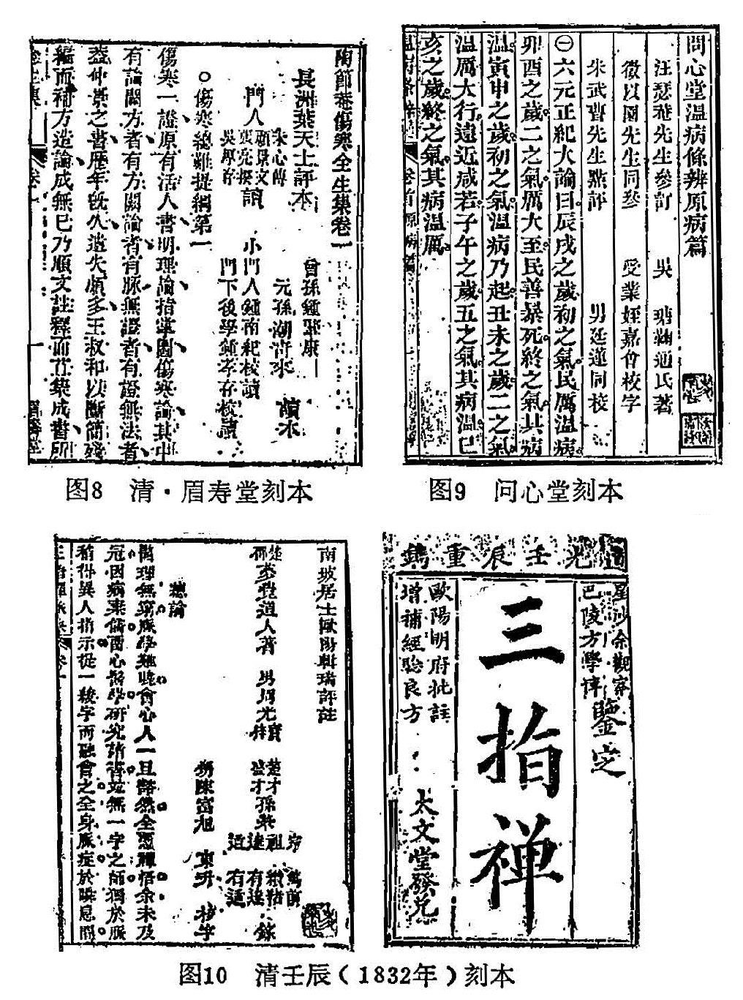

## 一、题名

中医文献数以万计，其中书名、人名、地名、官名、肆名等等，多不胜览。我们欲检索自己所需要的文献，首先接触到的便是这些许许多多的题名。《释名•释书契》：“题，谛也，审谛，其名号也。”虽然一个题名大都是支言片语，不成其文，但却可因名知事，因名知义，不可忽视。前面谈的是书名名义，这里主要谈格式。

（一）书名

古人著书，原为垂法济世，其初未尝先立书名而孜孜写作。书成，后世或因人因事而名书。如《汉书艺文志•方技略》著录黄帝、扁鹊、白氏《内经》、《外经》，此乃因名因姓而名书。又《五藏六府痹十二病方》、《风寒热十六病方》、《金创疭瘛方》、《妇人婴儿方》等等，此乃因事而名书。有的医籍，如今之《灵枢经》，古名《九卷》，因其书原为九卷，因以为名。魏晋六朝，书名尚多简朴，如某人集方，即迳言某方，例如《张仲景方》、《华佗方》、《吴普本草》、《李当之本草》、《脉经》、《汤丸方》等等。后世名书，愈演愈繁。中医文献典籍命名相当复杂，复杂固然有它的坏处，但也有它的好处。好处是一行短短的书名，却给我们提供了许多信息。从前面讲到的中医文献名义便可说明，它使我们仅从书名，便初步知道它的科别、大体内容等等。实际情况是，一个书名，在它的名前名后还有不少附加的文字成份，它能进一步为我们提供不少情况。

1.书名位置：一般书名都是题在扉页、正文之前的卷端，也有题在目录前后、卷末或加题在序跋、书口等处，或上述各处同时题有书名。如清•黄虎臣《黄氏青囊全集秘旨》正文卷端、序、例之前并不题书名，全名仅有扉页、正文中间署明。

2.名冠名尾：一个正式的书名之前，往往还冠有一些品质性的文字补白，亦即修饰语，我们姑称之为“书名名冠”。如《重广补注黄帝内经素问》，“重广补注”就是名冠。有的名冠比较简单，如《重刻异授眼科》（作者藏康熙61年刘继礼刻本）、《校刊目经大成》（作者藏两仪堂刻巾箱本）、《评注薛氏医案》（作者藏清初精鈔本）、《精校伤寒辨证》等。有的名冠相当长，如《新镌陶节菴家藏秘授伤寒六书》（作者藏清裕元堂刻巾箱本）、《鼎雕徽郡原板合并大观本草炮制》（万历癸卯宝善堂刻本）、《京本校正注释音文黄帝内经素问灵枢集注》（明詹林书林刻本）。试看：一个书名名冠给我们提供了什么信息情况呢？它给我们提供了版本的品质、版次、作家以及增加的有关内容。有的名冠甚至连作家的官称、籍贯、刊刻者姓氏都提供了，如《青田刘伯温先生秘传踢打跌蹼损伤仙方（作者藏鈔本）、《太医张子和先生儒门事亲》（明刻本）、《王太史重订精刻戴院使证治要决》（明•王肯堂校、陈岐刻本）、《程进士松崖医径》（明•程衍道刻本）、《秘传常山杨敬斋针灸全书》（明刻本）、《吴门尤北田在泾氏大方杂症集议》（栖芬室藏鈔本）等。一些目录书在这方面未予充分注意和著之于录是不对的。我们自己在查找文献、翻阅典籍时，都要注意详细记录。

书名名冠内容不一，多不胜举，见于典籍图书者，统括如下：

（1）反映版次：有新、重、再、三、续、鼎等。如新刊、重刊、新编、重编等等，馀类推。惟“鼎”字比较生僻，较少使用，例如《鼎刻京版医方选要》。按鼎，新也、始也。《易•鼎》：“鼎•元吉，亨。”王弼注：“革去故而鼎取新”。又《文选•左太冲吴都赋》：“其居则高门鼎贵”。刘渊引应劭注：“鼎，始也。”鼎刻犹言新刻、始刻。

（2）反映工艺：有刊、刻、梓、锲、镌、鋟、雕、拓、影、绣、绘、鈔、写、录、稿等。鋟、彫以上、皆是刻削的意思。拓，只用于金石等拓印本，如拓本《千金宝要》（见图2）、《海上方》、《龙门方》（并作者藏本）。影有影刻、影印、影鈔。绣、绘多用于带有图像的书籍，如《绘图草木药性歌诀》、《绣像珍珠囊药性赋》。鈔、写、录、稿等，多用于未刊本。

（3）反映品质：有精、校、订、正、鉴、定、审、阅、修、改、详、选、足本、大字、秘本、真本、古本、珍本、魁本、京本、官本、袖珍等。上述常联语，如精选、校正、订补、鉴定、审定等等，馀类推。他如《真本千金方》、《珍本医书集成》、《古本难经阐註》等等不难理解。唯魁本、京本比较生僻，如《魁本袖珍方大全》、《京本活人心法》。京本也称京版，如《新刊京版校正大学医学正传》。按：《广雅•释诂》：“魁，大也。”京，亦大也。《尔雅•释诂》：“京，大也。”如前述《大观本草炮制》扉页题《京板本草炮制》，而卷端题“徽郡原板”，京字显非京都之意。魁本、京本，犹言大本；魁版、京版，犹言大版。

（4）反映增删：有增、广、补、批、评、句、读、圈、点、图、像、删、节、附等。如增补、增广、订补、徐批（例《徐灵胎批临证指南医案》）、叶评（例《叶天士先生评伤寒全生集》）等，馀类推。

（5）反映室名：古人书室、居处习惯起一个名号，如某堂、斋、屋等，经常连署在书名之前。如清•吴塘《问心堂温病条辨》（作者藏问心堂刻本）、清•诸泓《树滋堂三校醉玄痘纪神楼镜秘本》（作者藏康熙44年精写本）、清·唐见《益生堂医学心镜录》（作者藏乾隆12年刻本）、明•妙甫嘉《妙一斋医学正印种子编》（崇祯刻本）、清•曹禾《双梧书星医学读书志》（光绪鈔本）等。需要提及，这里的室名属于书名名冠，就是说它不是书籍正名的成份。这和前面所讲的以室名别号名书的意义不同。

（6）反映人名：不少书名将作者或校刊者的人名也一并刻出，如《新刊西晋王氏脉经大全》（正德13年刻本）、《易庵先生编注丹溪纂要》（嘉靖26年刻本）、《唐王焘先生外台秘要》（明程衍道刻本）、《重校宋窦太师疮疡经全书》（隆庆3年刻本）、《申斗垣校正外科启玄》（万历刻本）、《医无闾子医贯》（作者藏明末三多斋刻本，扉页作《赵氏医贯》）。同样，这和前面讲的以人名命书不同。

（7）反映称呼：常见者有先生、子、太医、医圣、医林状元、真人、仙翁、神仙、道人等，如《沈郎仲先生病机汇论》、《勿听子八十一难经俗解》、《孙真人备急千金要方》、《紫虚崔真人脉诀秘旨》（明鈔本）、《葛仙翁肘后备急方》（道藏本）、《锲太上天宝太素张神仙脉诀玄微纲领宗统》（万历27年刻本）、《云林医圣普渡慈航》（崇祯刻本）、《新刊医林状元寿世保元》（明刻本）、《葆光道人秘传眼科》（万历19年刻本）等。

书名的名尾，常见者有摘要、摘钞、节钞、补遗、汇刻、合刻、汇编、续、附、秘本等，均不难理解，不再详举。

（二）人名

包括原作者、继作者，如张仲景《伤寒论》、《金匮要略》，后人又进行注释、评论等，仲景即谓原作者，注释、评论等人，即继作者。还有一些参与者，如参与校对、书写、审阅、刊刻、评论等等。

1.人名位置：多题于扉页、卷端，也有只题于目录之前者，如天蓋楼刻本吕留良评《赵氏医贯》，只在目录前题“医无闾子著，吕医山人评”（见图3）。也有题名于书末者，多见于宋版书，而且详细者可以说是一个小跋。如宋•洪遵《洪氏集验方》书末题：“右集验方五卷，皆予平生用之有著验，或虽未及用而传闻之审者。刻之姑孰，与众共之。乾道庚寅（1170）十二月十日，番阳洪遵书。”又如宋•朱端章《卫生家宝产科备要》书末题：“长乐朱端章，以所藏诸家产科经验方编成八卷，刻版南康郡斋。淳熙甲辰岁（1184）十二月初十日。”也有全不署名者，如《颅囟经》、《绛雪丹书》等。

2.人名题式：医籍中的人名，通常多和籍贯、姓氏、字号、作品性质以及所参与的工作联系一起。有的还署明朝代、官称、尊称、谦称等。大体顺序有两种格式：

甲式：朝代、官称（或尊称）、籍贯、谦称、别号、姓名、字（甫，氏）、作品性质。

乙式：朝代、别号、字（氏）、姓名、作品性质。以上顺序中的各项，并不一定全都题出，或繁或简，因书而异。

甲式如《外科大成》（作者藏古雪堂刻本）卷端题：“太医院御医•燕越•祁坤•广生•甫•辑著”（见图4）。又如《分部本草妙用》（作者藏崇祯刻本）卷端题：“古吴•友七散人•顾逢伯•君升•父•纂”（见图5）。又如《医宗承启》（作者藏康熙41年兰松堂刻本）卷端题：“汉•长沙太守•张机•仲景氏•原文；清•歙西逸民•吴人驹•灵穉氏•疏衍”。

乙式如《秘传眼科七十二证全书》（影旧钞同仁斋本）卷端题：“武夷•精眼科•后学•晴峰•袁学渊•辑著”。又如《世济堂医案》（何时希藏稿本）卷端题：“青浦•元长•何世仁先生•著”。又《疫疹一得》卷端题：“桐溪•师愚氏•余霖•辑著”。

从以上举例中可以看出、两种格式各项虽然因书而多少不等，但顺序是大体如此的。下面我们讲一下题名各项应注意的若干问题。

（1）籍贯：由于作者的时代不同，因至今郡县兴废、名称更改而几经变迁。通常所题籍贯皆是当时的名称建治，所以有与今地名相合者，有不合者，不可误解。较多的是为了典雅，就连当时的地名也不写，而是署一古地名。如明•李中梓《医宗必读》题“云间李中梓士材父著”。云间是籍贯，但是不论明代或现代都没有云间县，它只是江苏省松江县的一个古称。

（2）名字：在人的名字之后常有个甫或父、氏字。甫是古代男子的一种美称，《说文》：“甫，男子美称也。”甫也作傅，今犹呼人尊称师傅。甫又声假为父，《春秋公羊传•桓公二年》：“先攻孔父之家”，汉•何休注：“父者，字也。”此父即甫。故后世常以甫、父称字。氏，亦字也。凡甫、父、氏之上的称呼，都是字而不是名。如前举“顾逢伯君升父”、“ 师愚氏余霖” ，等于说顾逢伯、字君升；余霖，字师愚。也有不加甫、父、氏者，已如前举，一般名随姓行，字居两端，号在名上。如前举“晴峰袁学渊”、“元长何世仁”，即袁学渊，字晴峰；何世仁，字元长；此是字在名上端例。又《温热经纬》题“海宁王士雄孟英纂”，即王士雄，字孟英，此是字在名下端例。又《伤寒瘟疫条辨》卷端题“夏邑后学栗山杨璿玉衡撰”，即杨璿，字玉衡，号栗山，此即号在名上例。我们不可将名、字、号颠倒误会。

（3）作品性质：原作者有撰、纂、著、述、传、授、集、辑、笔、记、编、修、钞、录等。这些用字最初或在不同的历史时期，原有它的特定涵义。后世由于各人的理解与习惯的不同，在中医文献中的使用已不太十分严格。以致同一部书、同一人著作，在不同的版本中就有不同的写法。如《赵氏医贯》，三多斋本题“逸士养葵赵献可纂著”，天盖楼本则题“医无闾子著”。大抵须看实际内容而定，有的基本上都是自己的经验、见识、创说、发明，多标写著、述、撰、传、授；基本上是前人旧说的转述、改编或蒐集、整理，多标纂、集、辑、笔、记、编、修；完全是旧文照钞，多标钞、录。中医文献除少部分外，多是几种内容体制兼而有之。张舜徽先生归为三门，他说：“按载籍极博，无踰三门。蓋有著作，有编述，有钞纂，三者体制不同，而高下自异”。又说：“试循时代以求之，则汉以上之书，著作为多。由汉至隋，则编述胜。唐以下雕板印刷之术兴，朝成一书，夕登诸板，于是类书说部，充栋汗牛，尽天下皆钞纂之编矣。学者于群书诚能区为三门而知其高下浅深，则用力之际，自有轻重缓急，而不致茫无别择也。”此论颇切要用。唯医学与文史哲略有不同，难以完全依编述、钞纂而定高下。蓋医籍亡佚甚多，虽编述亦非无很大价值，如《甲乙经》、《外台秘要》，其保存古经要籍之功、自不可没。明清以来，如《普济方》、《名医类案》等，虽属钞纂，其文献与应用参考价值，已不待言了。

继作者有注、释、训、解、诠、疏、笺、评、批、辨、演、学、正义、发明、发挥、衍义等等，我们将在下节论述文体时进—步讲到。

还有一些为完成一部作品的参与者，有的只写一个“参”字，并未署明参与什么工作，这类情况有些是为了託书传名，或託名传书，所谓“书以名贵”或“名以书传”。有的就明确参与了什么工作，常见者有校、阅、审、订、定、鉴、句、圈、点、读、钞、录、书、写、绘、画、刊、刻、梓、印等。如参校、参阅、校字、审定、鉴定、参订、梓行等等，馀类推。也有一些辅助性工作完全由个人承担的，如《本草原始》（作者藏乾隆19年存诚堂刻巾箱本）卷端题“雍邱正宇李中立纂辑并书画”。明清以来的医籍，多数是题录若干参与者的姓名。值得特别提及，有些书籍梓记了刻工的姓名，他们的劳动功绩智慧不仅不应埋没，而且对于版本学具有非常重要的意义。刻工的题式、位置均与上述不同。多在序、跋后，或正文末、书口等处。

（4）联名行款：通常是有上下、左右两种行款。名次排列则有上下、左右、上下加左右、上列左右加下列左右等多种形式。至于名次的先后上下，这要看某人的社会地位、声望、辈次而定，并不一定原作者在先在上，继作者或参与者在后在下。

上下行款例：简单者如《中藏经》（作者藏光绪6年徐沛刻本），卷端题“汉华佗元化撰（上款），上虞徐舜山重校（下款）”。复杂者限于版面的高度，一行不够则回行，虽然出现左右两行，实际上仍属上下行款例。如《新编伤寒类证便览》（辽宁藏明弘治刻本，见图6）卷端题“张仲景述，王叔和撰次，成无已註解（以上首行），黄仲理类证，新安陆彦功编集（以上次行）”。

左右行款例：简单者如《口齿类要》（明吴玄有刻本）卷端题“吴郡薛己著（首行），新都吴玄有校（次行）。复杂者如《目经大成》（作者藏两仪堂巾箱本，见图7）从右至左以次行款为“平昌慎斋魏国鉴定，卢汀不尘子黄庭镜燕台氏笔乘，上邑族弟香泉必智学源参阅，男鉏非在田省畊原订，孙玉峰瑛怀校刊，受业：门人胡鹏南腾霄、族叔文標庭树——同校”。

上下分别排列行款：如《陶节菴伤寒全生集》（眉寿堂本）上排题：“长洲叶天士评本，门人：朱心传、顾景文、张亮揆、吴厚存——读”，下排题“曾孙钟肇康，元孙潮青来——读本，小门人钟南纪校读，门下后学钟孝存校读”。又如《温病条辨》（问心堂自刻本）上排题“汪瑟菴先生参订，徵以园先生同参，朱武曹先生点评”。下排题“吴塘鞠通氏著，受业姪嘉会校字，男廷莲同校”。又如《三指禅》（作者藏道光8年大文堂刻本），上排题“南坡居士欧阳辑瑞评注，邵楚梦觉道人著”，中排题“男周光宝楚才、梓盛才”，下排题“孙荣宗笃前、祖缵绪，达有达、适有适录，甥陈富旭东升校字”。以上这种题名行款，都不能上下顺序读，他们的名次是上下分排又先后序次的。注意后辈子孙的姓，多数省略。有的没有省略，如《三指禅》是由于梦觉道人未题姓氏的缘故（按梦觉道人姓周，名学霆，字荆威）。见图8、9、10。

上下列加左右排列：这类情况多是一人领首，如《名医类案》（作者藏知不足斋刻本，见图11）题“新都篁南江瓘集（上款）”，下排从右至左题“后学：仁和余集蓉裳，钱塘魏之琇玉横，仁和沈烺敩曾，歙鲍廷博以文——重校”。

皇帝与中央政府撰书题名例：皇帝撰书是不题姓名的，只在书名题御撰、御纂、御制等，或题廟号年号，如《宋徽宗圣济经》，或题《御制圣济经》。如果是奉旨修撰的书籍，则在书名上加御定、钦定，如《御定医宗金鑑》。参加编著的臣子，题名的格式名次都有封建礼教的严格规定，完全和前述几种行款不同。如向皇帝上表，则领衔人即地位最高的在前，地位低的在后。如果是皇帝降谕，则名次相反，序言也是这样。宋朝校正医书局岀版的医书即是如此排列名次。臣子的姓名之上要写上一大行官职爵位名衔，相当繁琐。这里不拟详述。

以上我们讲述这些人名的行款格式对于我们瞭解作者的历史年代，鑑定版本，辨章学术，考镜源流，都提供了一定有用的参考或佐证资料。作为一本好的目录书，不著录这方面的内容是不妥的。

（三）肆名

肆名即书肆，亦称书舖、书坊、书林，今言书店、岀版社。它包括了刊刻者与发兑者或称发行者。通常这些书肆或公私刊刻者都起一个字号、名号，知见者有某某堂、斋、院、舍、馆、阁、楼、轩、室、房、居、亭、庄、园、坊等。如种德堂、广勤书堂、十竹斋、双泉书斋、宗文书院、翠岩精舍、乔山书舍、四知馆、文林阁、浩然楼、晦明轩、博济药室、小丘山房、经馀居、绿君亭、扫叶庄、翰墨园、读书坊等。也有不起什么斋名堂号的，直称某某书林、书坊、书舖、书肆、书堂、书塾、书市、文籍舖、书籍舖等。如书林余彰德、书坊唐少桥、岳家书坊、金台书坊、刘氏书肆、陈氏书堂、商山书塾、书市刘衡甫、张官人宅文籍舖、陈解元书籍舖等。自刻、家刻常署“家塾藏版”、“某某家藏”。地方官府、官学刊刻常署“本衙藏版”。直至近代才多名某某书局、书店。

这些刊刻者的字号也常常有个名冠和名尾，即在斋名堂号前后有个修饰语，多是地名、人名、行业名。如鳌峰熊宗立种德堂、熊冲宇种德堂、余氏（志安）勤有堂、叶氏（景逵）勤有堂、金陵唐氏（对溪）富春堂、建邑书林叶氏作德堂等。这些斋名堂号的修饰语也可以倒装题写，如怡庆堂余秀峰、履素居书坊唐鲤飞，这样，堂号后就出现名尾。也可以在斋名堂号前后分题，既有名冠，又有名尾，如建邑书林积善堂陈贤，馀可类推。斋名堂号的名冠名尾的题记资料也很重要，它有助于我们瞭解刊刻者的主人、历史年代、地区等情况，从而为我们鉴别版本与选择善本提供参考。名尾还有藏版、梓行、发兑等等，卷末、扉页常有“牌号”。
